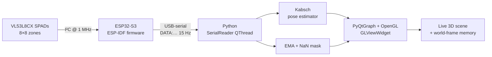

<h1 align="center">VL53L8CX × ESP32-S3 — Live 3D Point Cloud</h1>

<p align="center">
  <em>An 8×8 time-of-flight depth grid streaming over serial at 15 Hz, rendered in real time as a GPU-accelerated 3D point cloud with experimental 6-DOF pose tracking. Foundation for an assistive helmet with IMU fusion next.</em>
</p>

<p align="center">
  
  
  
  
  
</p>

---

<p align="center">
  <video src="visualizer/progress_demo_v6.mp4"
         controls muted autoplay loop playsinline width="820">
  </video>
</p>
<p align="center"><em>v6 — accumulated world-frame point memory wraps around the sensor as it pans, with a fading trajectory trail. Live at 15 Hz.</em></p>

---

## What it does

An ESP32-S3 talks to an **ST VL53L8CX** time-of-flight sensor over I²C, uploads ST's ULD firmware to the chip on boot, and streams the 64-zone depth grid as compact `DATA:d0,d1,…,d63\n` lines over USB-serial. A Python visualiser reads those lines and renders the scene in 3D — animated ToF rays from the sensor body, a side colour-bar with the distance scale, an experimental Kabsch-based 6-DOF pose estimator, and a world-frame point memory that builds a rolling 3D scan as the sensor sweeps.

## The hardware

<p align="center">
  
  &nbsp;&nbsp;
  
</p>
<p align="center">
  
</p>
<p align="center"><em>SATEL-VL53L8CX breakout on an ESP32-S3-DevKitC-1 — 2 × 1 kΩ pull-ups in series on each I²C line, 10 kΩ on PWREN, sensor powered from 3.3 V.</em></p>

## Architecture



## Iteration story — v1 → v6

The visualiser was rewritten three times. Each iteration solved a real, measured problem.

### v1 → v2 → v3 — fixing flicker, lag, and rotation responsiveness

<p align="center">
  <video src="visualizer/progress_demo.mp4"
         controls muted autoplay loop playsinline width="780">
  </video>
</p>
<p align="center"><em>Before / after — 3 s of the original matplotlib version, then 7 s of the v3 PyQtGraph rewrite. Mouse-drag rotation went from sluggish to native; the data pipeline went from one frame stale to drain-first newest-only.</em></p>

| | v1 / v2 (matplotlib) | v3 (PyQtGraph) |
|---|---|---|
| Renderer | software-rendered `mplot3d` | GPU `GLViewWidget` + OpenGL |
| Mouse rotation | sluggish (GUI thread starved) | native — pan/zoom decoupled from data |
| Serial read | on GUI thread; 1 s timeout could stall | dedicated `QThread` with Qt signal |
| Drain order | read → process → drain (always one stale) | drain first, render newest valid frame |
| Smoothing | EMA α = 0.3 (~900 ms settle) | EMA α = 0.6 (~300 ms settle) |
| Invalid zones | drawn as a phantom 4 m back-wall | masked to NaN, drawn transparent |

### v4 — scientific look + sensor model + animated ToF rays

<p align="center">
  <video src="visualizer/progress_demo_v4.mp4"
         controls muted autoplay loop playsinline width="780">
  </video>
</p>
<p align="center"><em>v4 in motion — sensor body at the origin, 45°×45° FoV frustum, side colour-bar (mm), animated ToF beams.</em></p>

The PyQtGraph rewrite was responsive but visually plainer than the matplotlib version. v4 added back the side colour bar, coloured X / Y / Depth axis arrows with text labels, depth tick marks every 1000 mm, a sensor-body model with a bright lens ring, the 45°×45° field-of-view frustum (per the ST datasheet — 65° diagonal, 45° per axis), and **one animated beam per zone** updated every frame and coloured by distance — visually pulses with the live data.

### v5 — experimental 6-DOF relative pose estimation (Kabsch / Procrustes)

With only the VL53L8CX (no IMU yet), the only way to estimate sensor motion is to use the depth data itself. v5 implements per-frame rigid registration on the 64-point cloud:

1. Subtract centroids: `Pc = P − mean(P)`, `Qc = Q − mean(Q)`
2. Cross-covariance: `H = Pc.T @ Qc`
3. SVD: `U, S, Vt = svd(H)`
4. Reflection guard: `d = sign(det(Vt.T @ U.T))`, `R = Vt.T @ diag(1, 1, d) @ U.T`
5. Translation: `t = mean(Q) − R @ mean(P)`
6. Compose into world pose: `T_world(k) = T_world(k-1) · δ`, with sanity gates (≤ 300 mm and ≤ 20° per frame).

### v6 — world-frame point memory + fading trail

The v5 pose unlocks accumulating past observations. Every frame, valid sensor-frame points are transformed into world frame (`world_p = R_world · sensor_p + t_world`) and pushed into a rolling 6-second deque. For rendering, the buffer is transformed *back* into the current sensor frame each tick, with per-point alpha fading by age. As the sensor pans, old observations stay where they were physically measured and slide off to the side instead of staying glued to the front cone — the cone effectively wraps around. The trajectory trail is now per-vertex alpha-faded from invisible at the tail to bright yellow at the head.

> **Honest limit:** depth-only pose estimation drifts. Yaw (rotation around gravity) is unobservable from a flat-floor depth map, no matter the algorithm. The 6-second memory cap keeps drift damage local. **Further visualiser work is paused until the IMU arrives** — fusion of accelerometer + gyro with the existing Kabsch estimator is the next iteration.

## Quick start

```bash
# 1. Firmware
cd vl53l8cx_esp32
idf.py set-target esp32s3
idf.py -p COM12 flash         # adjust COM port for your machine

# 2. Visualiser (in a different terminal — flash/monitor must be closed)
cd visualizer
python -m venv venv && venv\Scripts\activate
pip install -r requirements.txt
python visualizer.py --port COM12
```

Press **R** in the visualiser window to reset the 6-DOF pose and clear the trail + accumulated cloud.

## Wiring

| SATEL pin | ESP32-S3 pin | Pull-up |
|---|---|---|
| `PWREN` | GPIO 5 | 10 kΩ → 3.3 V |
| `MCLK_SCL` | GPIO 2 | 2 × 1 kΩ in series → 3.3 V |
| `MOSI_SDA` | GPIO 1 | 2 × 1 kΩ in series → 3.3 V |
| `NCS` | 3.3 V | tied high (selects I²C) |
| `SPI_I2C_N` | GND | tied low (locks I²C) |
| `VDD` | 3.3 V | (LDO accepts 2.8–5.5 V) |
| `GND` | GND | — |

> Pull-up resistors connect **between the signal line and 3.3 V**, not in series along the wire. Power the sensor from 3.3 V — not 5 V. Use the **UART USB port** (left, on DevKitC-1) for flashing.

<details>
<summary><strong>Configuration knobs (firmware)</strong></summary>

Edit the defines at the top of [`main/main.c`](main/main.c):

| Define | Default | Options |
|---|---|---|
| `GPIO_SDA` / `GPIO_SCL` / `GPIO_PWREN` | 1 / 2 / 5 | any valid GPIO |
| `SENSOR_RESOLUTION` | `VL53L8CX_RESOLUTION_8X8` | `_4X4` |
| `RANGING_FREQ_HZ` | `15` | 1–15 Hz (8×8), 1–60 Hz (4×4) |
| `STREAM_DATA` | `1` | `0` to silence the `DATA:` lines |
| `PRINT_GRID` | `0` | `1` for the ASCII 8×8 grid |
| `PRINT_CLOSEST_ONLY` | `0` | `1` for nearest-zone log only |
| `MAX_DISTANCE_MM` | `4000` | clamp value for invalid zones |

</details>

<details>
<summary><strong>Troubleshooting</strong></summary>

| Symptom | Cause | Fix |
|---|---|---|
| Sensor not detected | wiring issue | Check SDA/SCL aren't swapped, pull-ups go to 3.3 V (not in-line). |
| Silent hang after "interface starting" | I²C read timeout = `-1` (infinite) | Already fixed in `sdkconfig.defaults` (`CONFIG_VL53L8CX_I2C_TIMEOUT=y`, value 1000). |
| 5 V pin reads ~2 V | plugged into native USB port | Use the UART port, or power the sensor from 3.3 V (the SATEL LDO accepts 2.8–5.5 V). |
| Stack overflow | main stack too small | Already raised to 8192 bytes in `sdkconfig.defaults`. |
| Visualiser can't open COM12 | `idf.py monitor` is holding it | Close monitor (Ctrl + ]) before launching the Python visualiser. |
| Build fails | wrong IDF version | Requires ESP-IDF v5.0+. |

</details>

## Project layout

```
vl53l8cx_esp32/
├── main/
│   ├── main.c                  # sensor init, ULD upload, ranging loop, DATA: streaming
│   └── idf_component.yml       # pulls rjrp44/vl53l8cx ^4.0.0 automatically
├── visualizer/
│   ├── visualizer.py           # live PyQtGraph 3D scene + scientific overlay
│   ├── pose_estimator.py       # Kabsch/SVD 6-DOF relative pose, gated and composable
│   ├── progress_demo*.mp4      # screen-capture clips (v3 vs v4 vs v6)
│   └── README.md
├── images/                     # hardware photos + first-light point-cloud screenshot
├── sdkconfig.defaults          # I²C timeout, raised stack, log levels
├── PROGRESS.md                 # full iteration log + every fix and its evidence
└── README.md                   # you are here
```

For the full development log — every problem hit, every fix and the evidence behind it — see [`PROGRESS.md`](PROGRESS.md). The visualiser has its own deeper README at [`visualizer/README.md`](visualizer/README.md).

## What's next (queued for IMU integration)

1. **Sensor fusion** — accelerometer + gyro on the same I²C bus. Gravity gives absolute pitch/roll; gyro integration plus accel-gravity correction tightens yaw, which is what unlocks a non-drifting 3D scan.
2. **Interpolated topographic surface** — bicubic interpolation across the 8×8 grid, rendered as a smooth 3D mesh with viridis colouring and contour lines every 100 mm.
3. **Proximity overlay** — highlight zones below a configurable threshold to flag obstacles in the helmet's line of sight.
4. **Helmet integration** — wider-angle ToF / ultrasonic for full spatial awareness.

## References

- [ST VL53L8CX product page](https://www.st.com/en/imaging-and-photonics-solutions/vl53l8cx.html) — datasheet, 65° diagonal / 45°-per-axis FoV, 1–15 Hz at 8×8.
- [RJRP44/VL53L8CX-Library](https://github.com/RJRP44/VL53L8CX-Library) — the ESP-IDF wrapper this project uses ([component registry](https://components.espressif.com/components/rjrp44/vl53l8cx)).
- [ESP-IDF programming guide](https://docs.espressif.com/projects/esp-idf/en/latest/) — required v5.0+.
