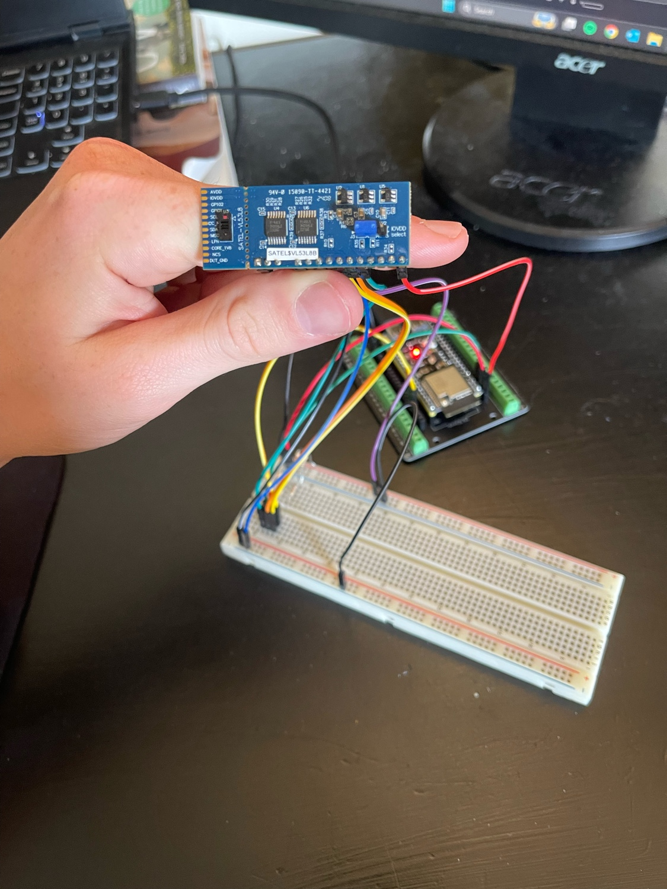
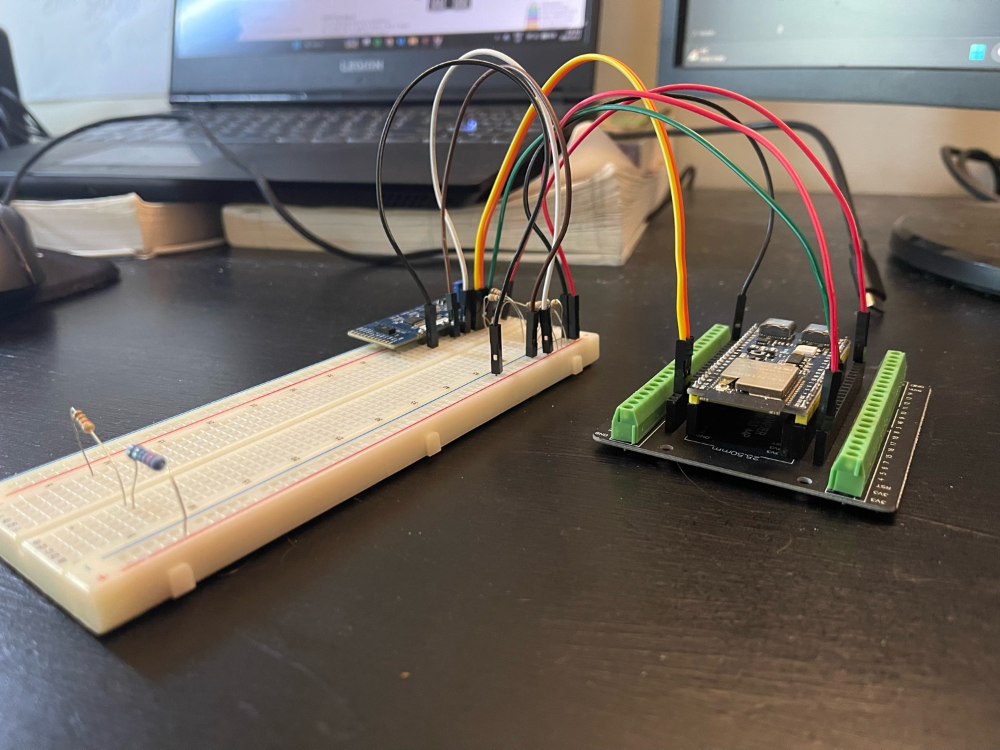
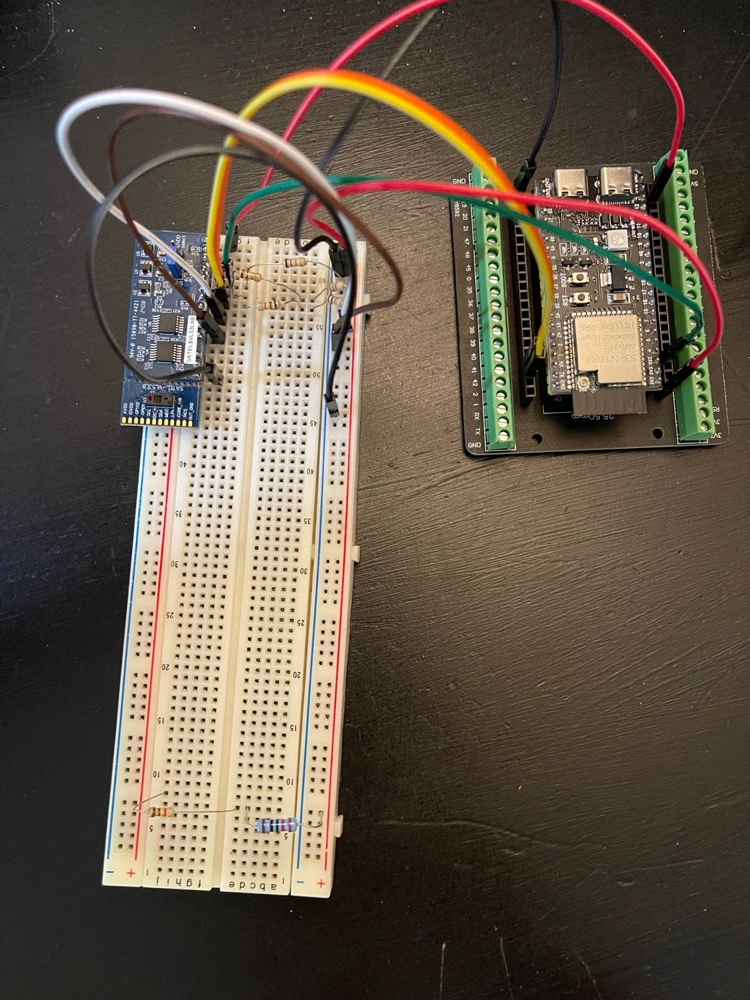

# VL53L8CX × ESP32-S3 Distance Sensor Interface

An ESP-IDF project that interfaces the STMicroelectronics SATEL-VL53L8CX time-of-flight breakout board with an ESP32-S3, returning live 8×8 zone distance readings over serial.

> Part of an ongoing assistive helmet sensor integration project.

---

## Hardware

<p align="center">
  
  &nbsp;&nbsp;
  
</p>

<p align="center">
  
</p>

---

## What It Does

- Initialises I2C communication between the ESP32-S3 and the VL53L8CX sensor
- Uploads ST's ULD firmware to the sensor on boot
- Configures 8×8 zone ranging at 10 Hz in continuous mode
- Prints a live ASCII distance grid (in mm) to the serial monitor every frame

Example output:
```
I (297) VL53L8CX: Sensor detected
I (297) VL53L8CX: Uploading ULD firmware (~1 s)...
I (297) VL53L8CX: Ranging started

--- Distance grid (mm) ---
  820  815  801  790  785  780  775  770
  810  808  795  782  779  771  768  762
  800  797  789  775  770  765  760  755
  ...
--------------------------
```

---

## Hardware

### Components
- ESP32-S3-DevKitC-1 (N16R8)
- STMicroelectronics SATEL-VL53L8CX breakout board
- 4× 1kΩ resistors (used as 2×2kΩ pull-ups for SDA and SCL)
- 1× 10kΩ resistor (pull-up for PWREN)
- Breadboard and jumper wires

### Wiring

| SATEL Pin   | ESP32-S3 Pin | Notes                                       |
|-------------|--------------|---------------------------------------------|
| PWREN       | GPIO 5       | + 10 kΩ pullup resistor to 3.3V             |
| MCLK_SCL    | GPIO 2       | + 2× 1kΩ in series pullup to 3.3V (= 2kΩ)  |
| MOSI_SDA    | GPIO 1       | + 2× 1kΩ in series pullup to 3.3V (= 2kΩ)  |
| NCS         | 3.3V         | Tie directly high — selects I2C mode         |
| SPI_I2C_N   | GND          | Tie directly to GND — locks I2C mode         |
| VDD         | 3.3V         | Sensor onboard LDO accepts 2.8–5.5V input   |
| GND         | GND          | Common ground                               |

### Pull-up resistor wiring (important)
Pull-up resistors connect **between the signal line and 3.3V** — they are not wired in-line between the ESP32 and sensor. The correct topology is:

```
3.3V
 │
1kΩ
 │
1kΩ
 │
 ├──── ESP32-S3 GPIO pin
 └──── Sensor signal pin
```

### ESP32-S3-DevKitC-1 pin locations
| Signal | Side of board | Position from top |
|--------|--------------|-------------------|
| GPIO 1 (SDA) | Right | 4th pin |
| GPIO 2 (SCL) | Right | 5th pin |
| GPIO 5 (PWREN) | Left | 5th pin |
| 3.3V | Left | 1st or 2nd pin |
| GND | Right | 1st pin |

> **Note:** GPIO 1 and GPIO 2 are on the **right** side of the board. GPIO 5 is on the **left** side. Power the sensor from 3.3V — not 5V. The 5V pin on the DevKitC-1 only outputs correctly when powered via the UART USB port, and the sensor's onboard LDO works fine from 3.3V.

---

## Software

### Requirements
- [ESP-IDF v5.0 or later](https://docs.espressif.com/projects/esp-idf/en/latest/)
- [rjrp44/vl53l8cx v4.0.0](https://components.espressif.com/components/rjrp44/vl53l8cx) — fetched automatically on first build

### Build and flash

```bash
cd vl53l8cx_esp32
idf.py set-target esp32s3
idf.py build
idf.py -p COM12 flash monitor   # replace COM12 with your port
```

> Use the **UART USB port** (left port on DevKitC-1) for flashing and serial monitor.

### Configuration

Edit the defines at the top of `main/main.c`:

| Define | Default | Options |
|--------|---------|---------|
| `GPIO_SDA` | `GPIO_NUM_1` | Any valid GPIO |
| `GPIO_SCL` | `GPIO_NUM_2` | Any valid GPIO |
| `GPIO_PWREN` | `GPIO_NUM_5` | Any valid GPIO |
| `SENSOR_RESOLUTION` | `VL53L8CX_RESOLUTION_8X8` | `VL53L8CX_RESOLUTION_4X4` |
| `RANGING_FREQ_HZ` | `10` | 1–15 Hz (8×8), 1–60 Hz (4×4) |
| `PRINT_GRID` | `1` | `0` to disable ASCII grid |
| `PRINT_CLOSEST_ONLY` | `0` | `1` to log only nearest zone |

---

## Project Structure

```
vl53l8cx_esp32/
├── CMakeLists.txt          root build file
├── sdkconfig.defaults      pre-configured stack size and I2C timeout
├── README.md
└── main/
    ├── CMakeLists.txt
    ├── idf_component.yml   pulls rjrp44/vl53l8cx ^4.0.0 automatically
    └── main.c              sensor interface — init, firmware upload, ranging loop
```

---

## Troubleshooting

| Symptom | Cause | Fix |
|---------|-------|-----|
| Sensor not detected | Wiring issue | Check SDA/SCL aren't swapped, check pull-ups go to 3.3V not in-line |
| No output after "interface starting" | I2C timeout / sensor not responding | Check all signal wires are in the correct GPIO rows |
| 5V pin reading ~2V | Plugged into native USB port | Use UART port, or power sensor from 3.3V instead |
| Stack overflow | Main stack too small | Already fixed in `sdkconfig.defaults` |
| Build fails | Wrong IDF version | Requires ESP-IDF v5.0+ |

---

## References

- [RJRP44/VL53L8CX-Library](https://github.com/RJRP44/VL53L8CX-Library)
- [rjrp44/vl53l8cx — ESP Component Registry](https://components.espressif.com/components/rjrp44/vl53l8cx)
- [ST VL53L8CX Product Page](https://www.st.com/en/imaging-and-photonics-solutions/vl53l8cx.html)
- [ESP-IDF Programming Guide](https://docs.espressif.com/projects/esp-idf/en/latest/)
