<h1 align="center">Assistive Helmet</h1>

<p align="center">
  <em>A helmet that answers what the white cane can't: what's at head height, what's approaching, and where exactly the thing you want is.</em>
</p>

<p align="center">
  
  
  
  
  
</p>

---

<p align="center">
  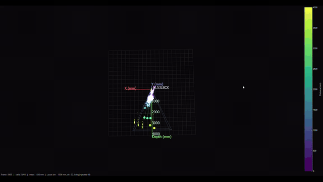
</p>
<p align="center"><em>The helmet's two depth sensors building a live 3D scan as the head pans. Demo video of the full system: coming with the field-test release.</em></p>

---

## Why

Blind pedestrians with a cane or a guide dog still take head-level hits — 13% report one at least monthly, and the number is the same for cane and dog users. GPS says "you have arrived" from 5–20 meters away, often on the wrong side of the building. And there is no way to ask the street a question. This helmet is a research prototype aimed at those three gaps. It stays silent until it matters, it never guides anywhere you didn't choose, and the cane stays in charge of the ground.

It is not a mobility aid and not a substitute for a white cane, a guide dog, or O&M training.

## What it does

**Protect** — hazards above cane height, silent by default:
- Tiered voice: nothing → "chair, left" on change → "stop stop" directive that interrupts everything
- Proximity as a tick that speeds with time-to-collision — panned to the hazard's direction — not numbers
- Gravity-referenced head-clearance watch: "low clearance, duck" computed in the world frame from live IMU attitude, so it works mid-stride at any head pitch
- Three temple motors with a walkable-corridor mode: silence when centered, pulses only as you drift toward a wall
- Speech gates itself during fast head turns (a stale "left" mid-scan is worse than silence)
- If the helmet falls, it says so and repeats until picked up

**Guide** — to a target you choose, never a guess:
- "scan doors" → "door one, twelve o'clock, about six steps; door two…" → pick one → Microsoft Soundscape's actual audio beacon (their open-sourced assets) leads you, arrival melody at one meter
- "find exit" → OCR scans as you pan, locks the beacon on the matched word in world coordinates — it keeps working when you look away
- Distances spoken in your calibrated steps, not meters

**Answer** — on demand only:
- "what's around" → one item per sector, terse; ask again for ranges; a third time for a full scene description
- "describe" / "what's in my hand" → a vision-language model answers in one sentence, and says "I can't see that clearly" rather than guess — blind users can't detect a wrong answer, so the system never bluffs
- "read that" → speaks the dominant text in view
- All of it by voice (wake word "Iris"), keyboard, or a double-tap on the shell

**The Iris phone app** — the whole rig is monitored and driven from a phone
with zero App Store involvement: a PWA (`Add to Home Screen` in Safari)
that launches fullscreen under its own icon. Live annotated video at max
size with translucent controls placed in the letterbox space, a status bar
showing what Iris last said, and touch buttons (around / describe / mute /
flag) feeding the same command queue as voice. An always-on launcher
(`camera/launcher.py`, runs at login) means the icon works even when the
software isn't running — it shows a Start button, boots the whole stack,
and hands over to the live view. The desktop window mirrors the same UI.

## The numbers

| What | Measured |
|---|---|
| ToF↔camera extrinsic calibration | 5.5 mm rms, 1.15° from CAD, 39 poses |
| Full CV pipeline on the field laptop | 27 fps segmentation, 114 ms open-vocabulary door scan |
| Scene OCR (cloud) | 1.3–2.4 s, per-word bearings |
| Scene description (cloud VLM) | 2–6 s, abstention-prompted |
| Head-turn gate estimator | tracks 191°/s, decays to 0 on stop |
| False positives | logged per session as FP/hour — the metric that kills devices like this |

## How it works

Two $6 ST VL53L8CX time-of-flight sensors (seam-abutted for a ~90° depth field) and a fisheye camera on a bike helmet, an ESP32-S3 streaming depth + IMU attitude over WiFi, and a laptop fusing it: YOLO segmentation ranges each object by the depth zones its mask claims; an open-vocabulary detector finds doors on demand; cloud models handle text and description. Output is a tier engine modeled on assistive-audio research — Microsoft Soundscape's design language, fighter-aviation callout structure, bat-inspired time-to-collision coding — through open-ear audio and temple haptics. Every alert, override, and near-miss is logged; a hush within ten seconds of an alert counts as a false-positive vote against it.

## Built on evidence

- 30+ commissioned research syntheses in [`docs/research-sources/`](docs/research-sources) — what blind users actually ask for, why every commercial wearable in this space died, and the implementation literature feature by feature
- Design constants read from [Microsoft Soundscape's source](docs/soundscape-reference), not its marketing; competitor patents (.lumen, Glidance, Toyota, Apple) mined for their engineering
- Methods published as prior art so they stay free: [defensive publication](docs/DEFENSIVE-PUBLICATION.md)
- The full build story, failures first: [`docs/DEVLOG.md`](docs/DEVLOG.md)

## Honest limitations

Glass is invisible to the depth sensors (the cane covers it — by design). Bright-sun range is untested and probably poor. Overhead coverage leans on natural gait pitch with the current sensor aim. Cloud features need connectivity (the field rig runs on a phone hotspot). One wearer so far.

Parts of the research synthesis and code were built with Claude as an engineering copilot; every measurement and design decision above was verified on the bench.

---

# Technical reference

## What it does

An ESP32-S3 talks to an **ST VL53L8CX** time-of-flight sensor over I²C, uploads ST's ULD firmware to the chip on boot, and streams the 64-zone depth grid as compact `DATA:d0,d1,…,d63\n` lines over USB-serial at 15 Hz. A Python visualiser reads those lines and renders the scene live — animated ToF rays from the sensor body, a side colour-bar with the distance scale, a Kabsch-based 6-DOF pose estimator, and a world-frame point memory that builds a rolling 3D scan as the sensor sweeps.

---

## Iteration gallery — v1 → v6 at a glance

<table align="center">
  <tr>
    <td align="center" width="25%">
      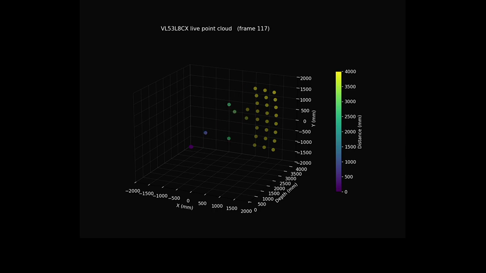
      <br/><strong>v1 / v2 — matplotlib</strong>
      <br/><sub>first scatter; flicker / drift fixed by v2</sub>
    </td>
    <td align="center" width="25%">
      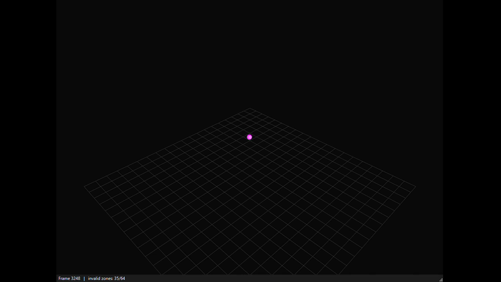
      <br/><strong>v3 — PyQtGraph + threaded</strong>
      <br/><sub>GPU rotation; drain-first pipeline</sub>
    </td>
    <td align="center" width="25%">
      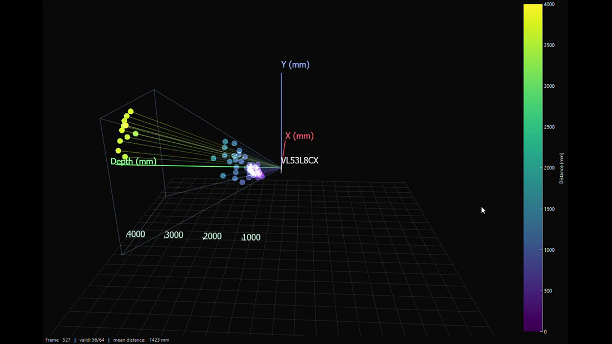
      <br/><strong>v4 — scientific look + ToF beams</strong>
      <br/><sub>colour bar, axes, sensor body, frustum</sub>
    </td>
    <td align="center" width="25%">
      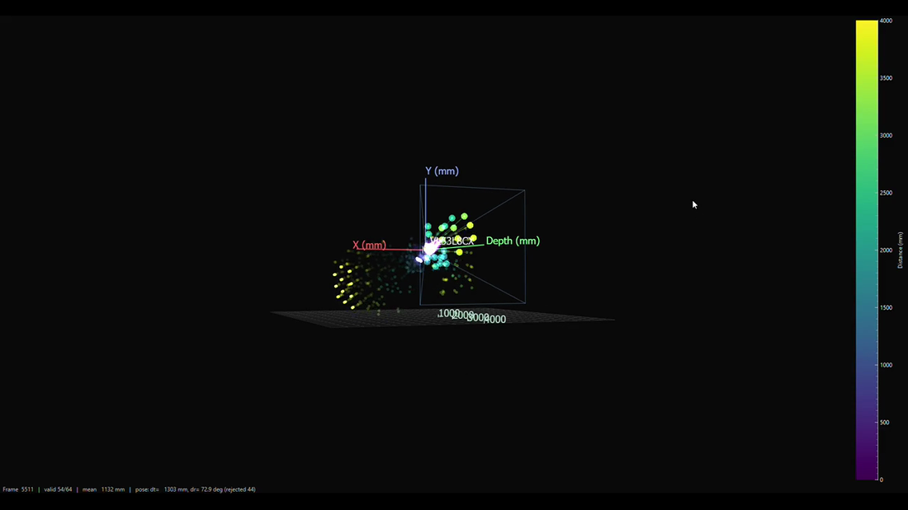
      <br/><strong>v6 — world-frame memory</strong>
      <br/><sub>+ Kabsch 6-DOF pose, fading trail</sub>
    </td>
  </tr>
</table>

---

## The hardware

<p align="center">
  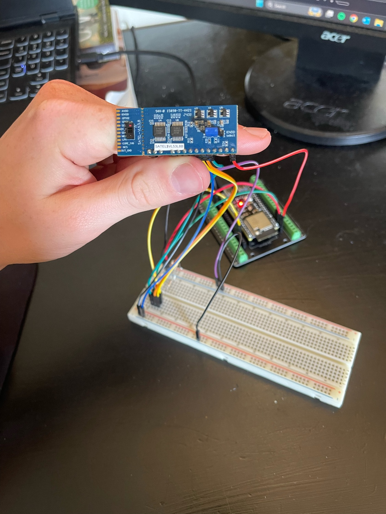
  &nbsp;&nbsp;
  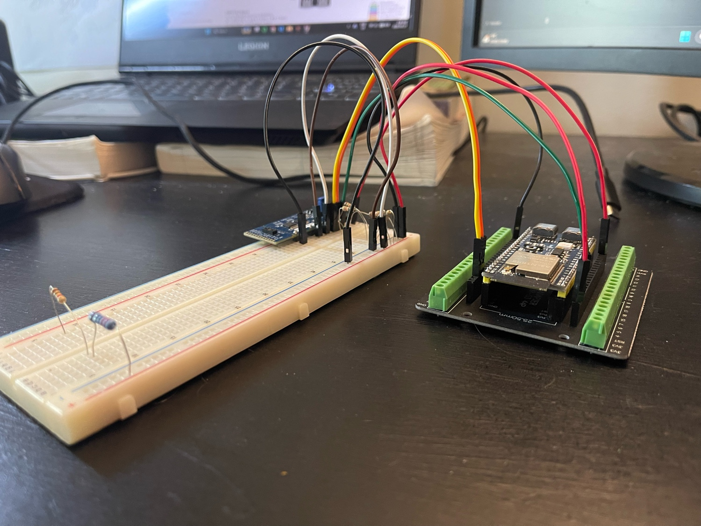
</p>
<p align="center">
  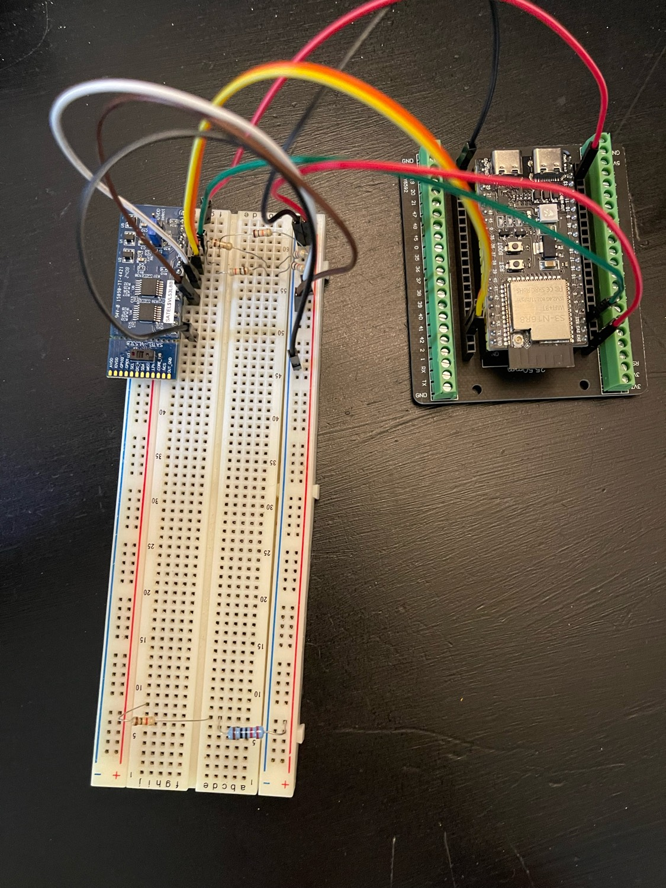
</p>
<p align="center"><em>SATEL-VL53L8CX breakout on an ESP32-S3-DevKitC-1. 2 × 1 kΩ pull-ups in series on each I²C line, 10 kΩ on PWREN, sensor powered from 3.3 V.</em></p>

---

## The transformation — matplotlib → PyQtGraph

The visualiser was rewritten three times in a single weekend. The first cut used matplotlib `mplot3d`; mouse rotation was sluggish and the renderer was always one frame stale. v3 swapped in PyQtGraph + OpenGL, threaded the serial reader, and flipped the drain order. The clip below is 3 seconds of the original, then 7 seconds of v3:

<p align="center">
  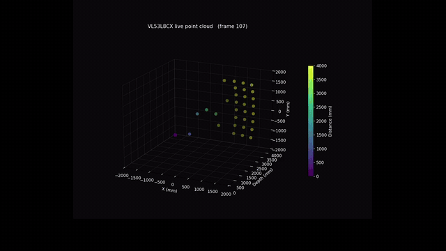
</p>
<p align="center">
  <em>Before / after — the same data on the same hardware, rendered through two different pipelines.</em>
  <br/>
  <sub><a href="visualizer/progress_demo.mp4">▶ HD MP4 (10 s, 134 KB)</a></sub>
</p>

| | v1 / v2 (matplotlib) | v3 (PyQtGraph) |
|---|---|---|
| Renderer | software-rendered `mplot3d` | GPU `GLViewWidget` + OpenGL |
| Mouse rotation | sluggish (GUI thread starved) | native — pan/zoom decoupled from data |
| Serial read | on GUI thread; 1 s timeout could stall | dedicated `QThread` with Qt signal |
| Drain order | read → process → drain (always one stale) | drain first, render newest valid frame |
| Smoothing | EMA α = 0.3 (~900 ms settle) | EMA α = 0.6 (~300 ms settle) |
| Invalid zones | drawn as a phantom 4 m back-wall | masked to NaN, drawn transparent |

---

## Architecture

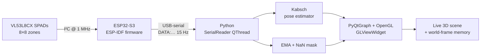
```mermaid
flowchart LR
    A[VL53L8CX SPADs<br/>8×8 zones] -- I²C @ 1 MHz --> B[ESP32-S3<br/>ESP-IDF firmware]
    B -- USB-serial<br/>DATA:… 15 Hz --> C[Python<br/>SerialReader QThread]
    C --> D[Kabsch<br/>pose estimator]
    C --> E[EMA + NaN mask]
    D --> F[PyQtGraph + OpenGL<br/>GLViewWidget]
    E --> F
    F --> G[Live 3D scene<br/>+ world-frame memory]
```

---

## What you're looking at

<p align="center">
  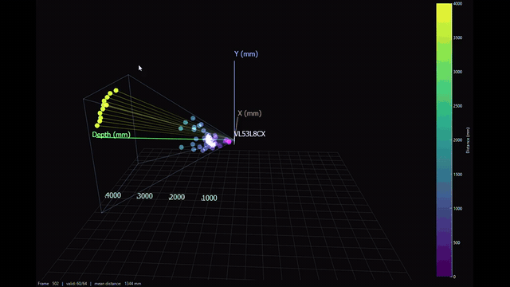
</p>
<p align="center">
  <em>v4 in motion — sensor body, FoV frustum, animated ToF beams. Same scene as v6 but without the world-frame memory layer, so each element is easier to identify in isolation.</em>
  <br/>
  <sub><a href="visualizer/progress_demo_v4.mp4">▶ HD MP4 (5 s, 182 KB)</a></sub>
</p>

| Element | What it is |
|---|---|
| **64 bright dots in a cone** | Live measurements, one per zone, coloured by distance (viridis: purple = close, yellow = far). |
| **Animated coloured beams from the sensor** | One ToF ray per zone, faded from the lens out to its endpoint, in the same hue as the point. They pulse with the live data — physically what a multizone ToF sensor is doing. |
| **Faded surrounding cloud** *(v6)* | Past observations in **world frame**, transformed back into the current sensor frame each tick and faded by age (~6 s memory). As you rotate, they slide off to the side instead of staying glued to the front. |
| **Yellow line behind the sensor** *(v5+)* | Estimated 6-DOF trajectory of the sensor's origin (last ~5 s), per-vertex alpha-faded so old segments disappear. |
| **Sensor body + lens ring at origin** | Flat dark rectangle modelling the SATEL-VL53L8CX face, with a bright lens circle and "VL53L8CX" label. |
| **Pale frustum** | The sensor's actual 45° × 45° field of view (per ST datasheet — 65° diagonal). |
| **Side colour bar** | Distance scale in mm. |
| **Status bar** | Live frame count, valid-zones / 64, mean valid distance, cumulative pose translation + rotation, and the per-frame rejection count. |

---

## Iteration story — v1 → v6

| Version | What it added | Why |
|---|---|---|
| **v1** | First working matplotlib 3D scatter. | Get *anything* on screen. |
| **v2** | In-place scatter update; serial-buffer drain; EMA smoothing. | Killed flicker, stale data, noise jitter. |
| **v3** | PyQtGraph + OpenGL; threaded serial; drain-first; α = 0.6; invalid-zone mask. | Fixed mouse-drag lag and one-frame-stale render. |
| **v4** | Side colour bar; X / Y / Depth axes; sensor body; FoV frustum; **animated ToF beams**. | Restored the "scientific" look + made the physics legible. |
| **v5** | **Kabsch / Procrustes 6-DOF relative pose estimator** with sanity gates and a trajectory trail. | First motion estimate from depth alone, no IMU. |
| **v6** | World-frame point memory (~6 s) re-projected each tick into the current sensor frame; per-vertex alpha-faded trail. | Makes the point cloud wrap around the sensor as it rotates instead of being glued to the front cone. |

For the full development log — every problem hit, every fix and the evidence behind it, every dead end — see [`PROGRESS.md`](PROGRESS.md).

---

## How the visualiser works

### Serial protocol
The ESP32 streams one compact line per frame:
```
DATA:820,815,801,790,...,(64 values total)
```
Invalid zones are clamped to `MAX_DISTANCE_MM` (= 4000 mm) on the firmware side, so the host always gets exactly 64 values. The visualiser detects the clamp and renders those zones with `α = 0`, hiding them. ESP_LOG lines in the same stream don't start with `DATA:` and are simply ignored by the parser.

### Threaded read pipeline
Serial reads run in a dedicated `QThread`; new frames are delivered to the GUI via a Qt signal. Each cycle drains everything currently buffered and keeps only the **newest** valid `DATA:` line — which kills the "rendering one frame stale" failure mode of the original `read → process → drain` order.

### Geometric projection
The VL53L8CX is **65° diagonal / 45° per axis**. Each of 8 zones along an axis subtends `45° ÷ 8 = 5.625°`. A unit direction vector is precomputed for every zone:

```text
h_angle = (col − 3.5) × 5.625°       v_angle = (row − 3.5) × 5.625°
x =  sin(h_angle)
y = −sin(v_angle)                     (row 0 is the top of the sensor view)
z =  cos(h_angle) × cos(v_angle)      (sensor boresight = +Z)
```

Multiplying each unit vector by its zone's measured distance gives the 3D point in the sensor's body frame.

<p align="center">
  
</p>
<p align="center"><em>First-light static screenshot — frame 1916, sensor pointed at a wall ~1800 mm away.</em></p>

### EMA smoothing
Raw zones jitter ±10–30 mm frame-to-frame on a static scene. Per-zone exponential moving average:

```python
smoothed[v] = 0.6 * new[v] + 0.4 * smoothed[v]
```

α = 0.6 settles to 95 % of a step input in `−ln(0.05) ÷ −ln(1 − 0.6) ≈ 3` samples — about 200 ms at 15 Hz.

### 6-DOF relative pose (Kabsch / Procrustes)

Closed-form rigid registration on consecutive 64-point clouds. Given paired sets P (frame k−1) and Q (frame k):

```text
1.  Pc, Qc      = P − mean(P), Q − mean(Q)
2.  H           = Pc.T @ Qc
3.  U, S, Vt    = svd(H)
4.  d           = sign(det(Vt.T @ U.T))         # reflection guard
5.  R           = Vt.T @ diag(1, 1, d) @ U.T
6.  t           = mean(Q) − R @ mean(P)
```

The fitted (R, t) maps a world point's old-frame coords to its new-frame coords. The **sensor's** per-frame motion is the inverse: `δR = R.T`, `δt = −R.T @ t`. World-frame cumulative pose composes as `T_world(k) = T_world(k-1) · δ`.

Same-zone correspondence relies on the small-motion assumption — at 15 Hz (~67 ms per frame) zone *i* in two consecutive frames still observes approximately the same world point. Wrong correspondence (fast motion) shows up as huge fitted Δt or ΔR; the estimator gates on `≤ 300 mm` and `≤ 20°` per frame and breaks the chain instead of corrupting cumulative state.

### World-frame point memory (v6)

Each frame, valid sensor-frame points are transformed via `world_p = R_world · sensor_p + t_world` and pushed into a rolling 6-second deque. For rendering, every entry is transformed *back* into the current sensor frame and given an alpha proportional to its age (newest = ~0.35, oldest = 0). The visual effect: as the sensor pans, old observations stay fixed in space and slide around — the "cone" effectively wraps around.

### Limitations

- 64 points × ±10–30 mm noise is sparse and noisy for ICP-style registration. Expect drift, especially in **yaw** (rotation around gravity is unobservable from a flat-floor depth map — no algorithm can recover it from depth alone).
- 0/64 valid zones (covered sensor, loose connection) → estimator pauses cleanly.
- The 6-second memory cap keeps drift damage local. With an IMU added later, the same code becomes a usable sparse 3D map.

---

## Quick start

```bash
# 1. Firmware  (ESP-IDF v5.0+, tested on v5.4.4)
cd vl53l8cx_esp32
idf.py set-target esp32s3
idf.py -p COM12 flash         # adjust COM port for your machine

# 2. Visualiser (in a separate terminal — flash/monitor must be closed)
cd visualizer
python -m venv venv && venv\Scripts\activate
pip install -r requirements.txt
python visualizer.py --port COM12
```

| Visualiser flag | Default | Description |
|---|---|---|
| `--port` | `COM12` | Serial port the ESP32 is on |
| `--baud` | `115200` | Matches the ESP-IDF console default |
| `--max-mm` | `4000` | Z-axis range + colour-scale max (mm) |

**Hotkey:** press **`R`** in the visualiser window to reset the cumulative pose and clear the trail + accumulated cloud.

---

## Wiring

### Sensor (SATEL-VL53L8CX)

| SATEL pin | ESP32-S3 pin | Pull-up |
|---|---|---|
| `PWREN` | GPIO 5 | 10 kΩ → 3.3 V |
| `MCLK_SCL` | GPIO 2 | 2 × 1 kΩ in series → 3.3 V |
| `MOSI_SDA` | GPIO 1 | 2 × 1 kΩ in series → 3.3 V |
| `NCS` | 3.3 V | tied high (selects I²C) |
| `SPI_I2C_N` | GND | tied low (locks I²C) |
| `VDD` | 3.3 V | (LDO accepts 2.8–5.5 V) |
| `GND` | GND | — |

> Pull-up resistors connect **between the signal line and 3.3 V**, not in series along the wire. Power the sensor from 3.3 V — not 5 V. Use the **UART USB port** (left, on DevKitC-1) for flashing.

### Actuators (alert outputs)

| Signal | ESP32-S3 pin | Driver | Notes |
|---|---|---|---|
| Buzzer | GPIO 6 | direct (drive cap 3, ~40 mA) | active 5 V piezo, `+` → GPIO 6, `−` → GND |
| Haptic motor — **CENTER** (forehead) | **GPIO 7**  | 1 kΩ → 2N3904 NPN base; collector → motor → 3V3; emitter → GND | LEDC ch 1 / timer 1 @ 1 kHz |
| Haptic motor — **RIGHT** temple | **GPIO 15** | same driver | LEDC ch 2 / timer 1 |
| Haptic motor — **LEFT** temple | **GPIO 16** | same driver | LEDC ch 3 / timer 1 |

> Mapping verified 2026-05-28 with the `HAPTIC_ID_MODE` single-pin pulse test (one motor pulses every 3 s, user reports which physical location buzzes). Aliases `HAPTIC_GPIO_CENTER` / `_RIGHT` / `_LEFT` defined in `main.c` so column→motor mapping reads geographically rather than by wiring order.

The buzzer owns LEDC channel 0 / timer 0; haptic motors share timer 1 across channels 1–3 so they can be driven independently from the same PWM frequency source. Motors are 70 Ω ERM coin (~43 mA stall each at 3 V) — well within a 2N3904's 200 mA Ic. Schottky 1N5819 flyback diodes (cathode → 3V3) and a 100 µF bulk cap across the 3V3 rail are recommended for the final perfboard build but were proven unnecessary for bench validation on the dev-board regulator. `main.c` forces all three motor GPIOs to OUTPUT-LOW with a pulldown at the start of `app_main` — guarantees no stuck-on motor across reboots regardless of build configuration.

<details>
<summary><strong>Configuration knobs (firmware)</strong></summary>

Edit the defines at the top of [`main/main.c`](main/main.c):

| Define | Default | Options |
|---|---|---|
| `GPIO_SDA` / `GPIO_SCL` / `GPIO_PWREN` | 1 / 2 / 5 | any valid GPIO |
| `SENSOR_RESOLUTION` | `VL53L8CX_RESOLUTION_4X4` *(was 8X8 prior to v7)* | `_8X8`. 4×4 = 16 zones with 4× more SPADs per zone (~4× lower per-zone noise per the v9 sweep); 8×8 = 64 zones with finer spatial detail but ~4× higher per-zone noise. |
| `RANGING_FREQ_HZ` | `30` *(was 15 / 10 / 8 in earlier iterations)* | 1–15 Hz at 8×8, 1–60 Hz at 4×4. Wearable-latency analysis (see `docs/research-optimal-config.md` Phase 1) showed frame latency dominates per-zone noise by 10–40× for a moving user — picked 30 Hz over 10 Hz for the reaction-time gain. 60 Hz worth empirical testing. |
| `HAPTIC_TEST` | `0` | `1` runs the 3-motor bench/identify test instead of the sensor pipeline (WiFi + OTA stay up either way). See v11. |
| `HAPTIC_ID_MODE` | `0` | When `HAPTIC_TEST=1`, set to `1` to pulse only `HAPTIC_ID_GPIO` for physical-motor identification. |
| `RANGING_MODE` | `VL53L8CX_RANGING_MODE_CONTINUOUS` | `_AUTONOMOUS` to set integration time explicitly |
| `STREAM_DATA` | `1` | `0` to silence the `DATA:` lines |
| `STREAM_SIGMA` | `1` | `0` to silence the `SIGMA:` lines (v7+) |
| `PRINT_GRID` | `0` | `1` for the ASCII 8×8 grid |
| `PRINT_CLOSEST_ONLY` | `0` | `1` for nearest-zone log only |
| `MAX_DISTANCE_MM` | `4000` | clamp value for invalid zones |
| `BUZZER_TEST` | `1` | obstacle-alert buzzer task (v8+); `0` to compile out |
| `BUZZER_GPIO` | `GPIO_NUM_6` | active-buzzer signal pin (v8+) |
| `OBSTACLE_THRESHOLD_MM` | `600` | buzzer triggers when any zone < this (v8+) |
| `BEEP_MS` | `50` | beep duration in ms (v8+) |
| `BEEP_GAP_MIN_MS` / `BEEP_GAP_MAX_MS` | `30` / `400` | beep gap at point-blank / at threshold (v8+) |

WiFi + OTA values live in `main/wifi_credentials.h` (gitignored) — see the "Credentials setup" subsection under v7.

</details>

<details>
<summary><strong>Troubleshooting</strong></summary>

| Symptom | Cause | Fix |
|---|---|---|
| Sensor not detected | wiring issue | Check SDA/SCL aren't swapped, pull-ups go to 3.3 V (not in-line). |
| Silent hang after "interface starting" | I²C read timeout = `-1` (infinite) | Already fixed in `sdkconfig.defaults` (`CONFIG_VL53L8CX_I2C_TIMEOUT=y`, value 1000). |
| 5 V pin reads ~2 V | plugged into native USB port | Use the UART port, or power the sensor from 3.3 V (the SATEL LDO accepts 2.8–5.5 V). |
| Stack overflow | main stack too small | Already raised to 8192 bytes in `sdkconfig.defaults`. |
| Visualiser can't open COMxx | `idf.py monitor` is holding it | Close monitor (Ctrl + ]) before launching the Python visualiser. Or use WiFi (`--host`) which doesn't share the port. |
| COMxx vanishes whenever the ESP resets | Native USB-CDC re-enumerates on reset | Use the **UART port** (CH343 → typically COM12 on Windows). The CH343 stays connected to the host regardless of ESP state. The native USB port (typically COM10) drops every time the ESP reboots. The `restart_tools.ps1` script + desktop shortcut handles the relaunch after each reset. |
| OTA push fails with HTTP 401 | wrong/missing `X-OTA-Token` header | Verify `OTA_TOKEN` in `wifi_credentials.h` matches the one in `ota_flash.py`. |
| OTA push fails with timeout / connection refused | ESP not on WiFi, or wrong IP | Re-check the boot log over UART for "Got IP: x.x.x.x". DHCP may have changed it. |
| Build fails | wrong IDF version | Requires ESP-IDF v5.0+ (developed against v5.4.4). |

</details>

---

## Project layout

```
vl53l8cx_esp32/
├── main/
│   ├── main.c                  # sensor init, ULD upload, ranging loop, DATA:/SIGMA: streaming, WiFi STA, TCP server (3333), OTA HTTP server (80)
│   ├── wifi_credentials.h      # SSID / password / OTA token (GITIGNORED — never committed)
│   ├── CMakeLists.txt          # component dependencies (esp_wifi, lwip, app_update, esp_http_server, etc.)
│   └── idf_component.yml       # pulls rjrp44/vl53l8cx ^4.0.0 automatically
├── visualizer/
│   ├── visualizer.py           # v6 — full PyQtGraph 3D scene with Kabsch pose + world-frame memory
│   ├── visualizer_simple.py    # v7 — stripped-down point cloud, blinker, rays. Serial OR WiFi.
│   ├── pose_estimator.py       # Kabsch/SVD 6-DOF relative pose, gated and composable
│   ├── measure.py              # v7 — tuning measurement: per-zone σ + valid yield, CSV log
│   ├── ota_flash.py            # v7 — push firmware to ESP over WiFi (POST /update)
│   ├── restart_tools.ps1       # v7 — one-click visualizer + monitor restart
│   ├── progress_demo*.gif      # inline-renderable demo clips for the README
│   └── progress_demo*.mp4      # original HD captures (downloadable)
├── images/                     # hardware photos + per-version poster screenshots
├── sdkconfig.defaults          # I²C timeout, raised stack, two-OTA partition layout, 16 MB flash
├── PROGRESS.md                 # full iteration log + every fix and its evidence
└── README.md                   # you are here
```

---

## Known limitations of v6

This project is paused at a deliberate stopping point. Every remaining issue below either needs new hardware or is an inherent property of the sensor — none are software defects that another rewrite would fix. Each item is documented with its root cause and what would resolve it:

- **Yaw drifts continuously.** Rotation around gravity is fundamentally unobservable from a flat-floor depth map — the same wall looks the same from every yaw angle. The Kabsch estimator fills the gap with whatever the noise suggests and accumulates error. Visible as the trail and accumulated cloud slowly rotating relative to a stationary scene over ~30 s.
- **All-axis drift over time, even on a static scene.** With ±10–30 mm per-zone noise and only 64 points, every frame's pose estimate has a small bias. Over a few hundred frames that integrates into a noticeable offset. The 6-second memory cap exists specifically because anything older than that is too drifted to be useful.
- **Same-zone correspondence breaks under fast motion.** The estimator assumes zone *i* in two consecutive frames sees roughly the same world point. A quick wave of the hand can shift several zones onto entirely different objects in one 67 ms tick — the gates (`≤ 300 mm`, `≤ 20°` per frame) catch this and the cumulative pose just *pauses*. Useful behaviour (better than corrupting the chain), but you'll see frames where the trail simply doesn't update.
- **Accumulated point cloud smears, not snaps.** When pose drifts, world-frame points from old frames end up at slightly wrong world coordinates. Returning the sensor to a previously-scanned region produces a "ghosted" cloud rather than perfect overlap. There is no loop closure.
- **64 points is genuinely sparse.** A consumer depth camera gives ~300 000 points per frame; this gives 64. ICP-style methods are noticeably less stable with this density. The visual effect is correct, but anyone expecting Kinect-grade scanning quality should know this is two orders of magnitude away from that.
- **EMA introduces a 200 ms tail.** Even at α = 0.6, the smoothed reading is ~200 ms behind a fast scene change. You'll see this when an object enters the FoV — the points snap into place over ~3 frames rather than instantly. Tradeoff for noise rejection; lowering α makes the points jitter visibly on a static scene.
- **Power glitches / loose connections silently produce 0/64-valid frames.** When that happens, every zone clamps to 4 000 mm and renders transparent — the cone "goes dark" with no error popup, just a status-bar reading of `valid 0/64 | pose paused`. This was hit several times during development (see [`PROGRESS.md`](PROGRESS.md) issue #6).
- **Sensor cover glass / fingerprints / tilt-induced specular drop matter.** A smudge or a steep angle on a glossy surface drops valid-zone count to a handful, which both starves the live cloud and kills the pose estimator's correspondence count below its 6-point threshold.

The fix for the first four items is the same: **add an IMU**. A 6-axis MPU-6050 / LSM6DSO on the same I²C bus gives gravity (absolute pitch / roll, no drift), gyro rate (yaw integration with accel-gravity correction, far less drift than depth-only), and a hardware-level timing reference. None of these can come from the VL53L8CX alone, no matter how good the algorithm is. The remaining items are sensor-physics ceilings that no software change can move.

---

## v7 — Untethered: WiFi streaming + OTA reflashing

Phase-1 firmware improvements (no algorithm changes — the sensor pipeline itself is unchanged from v6). The point of v7 is to cut the USB cable for two operations: **streaming data** and **flashing firmware**. Both now happen over WiFi.

### What changed

- **Per-zone `range_sigma_mm` is now also streamed.** Each frame the ESP emits a `SIGMA:s0,s1,…,s63\n` line right after the existing `DATA:` line. The sigma values are the ULD's on-chip per-measurement uncertainty estimate (in mm). Hosts can use them as a real-time quality flag and as a sanity check against an externally-computed σ.
- **Status filter widened from `{5}` to `{5, 6, 9}`.** Status 5 = 100 % confidence; 6 = wrap-around-not-done (still valid at sub-4 m range); 9 = low signal but range valid. The wider filter raises valid yield on dim or angled surfaces. (Per ST UM3109 §5.5.)
- **WiFi station mode + single-client TCP server on port 3333.** The same `DATA:` / `SIGMA:` lines are written to both UART AND any TCP client that connects. UART keeps working as a fallback.
- **OTA firmware updates over WiFi.** Two-OTA partition layout. A small HTTP server on port 80 accepts `POST /update` with an `X-OTA-Token` header; the body is streamed into the inactive partition, finalised, and booted into on reboot. After the first manual USB flash, every subsequent flash is wireless.
- **Credentials never enter the repo.** SSID, password, and OTA token live in `main/wifi_credentials.h`, which is gitignored. The file is created from the template `main/wifi_credentials.h.template` when cloning fresh.
- **Sensor-init-before-WiFi ordering.** WiFi current spike on boot can brown the sensor's 5V rail; the ranging task is started first and given a 2.5 s head start before the WiFi stack comes up.

### v7 architecture

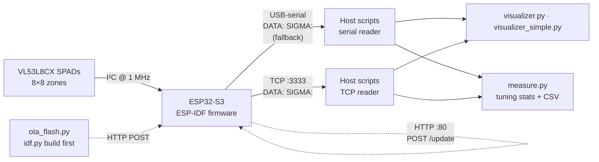
```mermaid
flowchart LR
    A[VL53L8CX SPADs<br/>8×8 zones] -- I²C @ 1 MHz --> B[ESP32-S3<br/>ESP-IDF firmware]
    B -- USB-serial<br/>DATA: SIGMA:<br/>(fallback) --> C1[Host scripts<br/>serial reader]
    B -- TCP :3333<br/>DATA: SIGMA: --> C2[Host scripts<br/>TCP reader]
    B -. HTTP :80<br/>POST /update .-> B
    C1 --> V[visualizer.py · visualizer_simple.py]
    C2 --> V
    C1 --> M[measure.py<br/>tuning stats + CSV]
    C2 --> M
    H[ota_flash.py<br/>idf.py build first] -. HTTP POST .-> B
```

### New host-side tools

| Tool | Purpose |
|---|---|
| `visualizer/visualizer_simple.py` | Stripped-down point cloud (no pose, no trail, no FoV frustum). Adds a status-bar blinker pulsing at the framerate + lines from origin to each measured point. Accepts `--port COMxx` OR `--host <ip>`. |
| `visualizer/measure.py` | Tuning measurement script. Captures N frames, computes per-zone mean / σ / valid yield / mean sensor-sigma. Median σ across zones is the headline metric. Appends CSV — one row per zone per run. Accepts `--port` OR `--host`. |
| `visualizer/restart_tools.ps1` | One-click PowerShell script that kills any running visualizer + monitor and relaunches both. Companion desktop shortcut (`Restart ESP Tools.lnk`). Workaround for the ESP32-S3 native USB-CDC dropping COM enumeration on every reset. |
| `visualizer/ota_flash.py` | Pushes `build/vl53l8cx_esp32.bin` to the ESP via `POST http://<ip>/update` with the X-OTA-Token header. Workflow: `idf.py build` then `python visualizer/ota_flash.py` — done in seconds, no cable. |

### Quick start — wired vs wireless

```bash
# Wired (first time, also the only USB flash needed)
idf.py -p COM10 flash
python visualizer/visualizer_simple.py --port COM10        # serial point cloud
python visualizer/measure.py --port COM10 --frames 200 \
       --config "baseline-15hz-8x8"

# Wireless (after first flash; no USB needed)
python visualizer/visualizer_simple.py --host 192.168.1.228
python visualizer/measure.py --host 192.168.1.228 --frames 200 \
       --config "baseline-15hz-8x8-wifi"
idf.py build && python visualizer/ota_flash.py 192.168.1.228   # OTA reflash
```

### Credentials setup (first-time clone)

The file `main/wifi_credentials.h` is **not in the repo**. Copy the template and fill in your values:

```c
#pragma once
#define WIFI_SSID     "<your-network>"
#define WIFI_PASSWORD "<your-password>"
#define TCP_PORT      3333
#define OTA_HTTP_PORT 80
#define OTA_TOKEN     "<pick-a-random-token>"     // must also live in ota_flash.py
```

The OTA token is what `ota_flash.py` sends in the `X-OTA-Token` header — keep both copies in sync.

### Gotcha if you change the partition table or flash size mid-project

`sdkconfig.defaults` only takes effect when `sdkconfig` is generated **for the first time**. If you change a value in `sdkconfig.defaults` after `sdkconfig` already exists, the change is ignored — the existing `sdkconfig` wins. Symptom (seen during v7 dev): OTA push fails with `esp_ota_get_next_update_partition()` returning NULL because the partition table is still `SINGLE_APP` instead of `TWO_OTA`. Fix:

```bash
rm sdkconfig          # delete and let it regenerate from sdkconfig.defaults
idf.py build          # rebuilds sdkconfig + new partitions + ota_data_initial.bin
idf.py -p COM10 flash # USB-flash one more time to install the new layout
```

After that one manual flash, OTA pushes work for all subsequent firmware iterations.

---

## v8 — First sensor → actuator loop (obstacle alert)

Phase-1 functional milestone: the sensor now drives an output. The helmet now actively *signals* what it sees rather than just streaming numbers.

### What's new

- **Active buzzer on GPIO 6** with a dedicated FreeRTOS task. Drive strength bumped to `GPIO_DRIVE_CAP_3` (~40 mA) so the active buzzer's current draw doesn't collapse the GPIO voltage. Stack 4096 bytes (2048 was overflowing — see "Lessons" below).
- **Nearest-zone tracker:** every ranging frame, the ranging task scans all 64 (or 16) zones, finds the minimum valid distance, and publishes it as `g_nearest_mm` (atomic 16-bit volatile, no mutex needed on ESP32-S3).
- **Distance-proportional beep rate:** the buzzer task polls `g_nearest_mm` at 10 Hz and only beeps when something is closer than `OBSTACLE_THRESHOLD_MM` (60 cm default). Beep gap interpolates linearly between `BEEP_GAP_MAX_MS` (slow alert at threshold) and `BEEP_GAP_MIN_MS` (frantic chirping at point-blank). Closer = faster = more urgent. Classic obstacle-alert UX.
- **Beep duration `BEEP_MS` = 50 ms** — short pulse is audibly quieter than the previous 200 ms while still being noticeable.

### Wiring

| Pin | Connection |
|---|---|
| GPIO 6 (board silkscreen `6` on TOP of LEFT header) | Active buzzer `+` |
| GND | Active buzzer `−` |

The buzzer can sit on the same dev board headers as the sensor — they share nothing.

### Configuration knobs

| Define | Default | Notes |
|---|---|---|
| `BUZZER_TEST` | `1` | set `0` to compile out the buzzer task entirely |
| `BUZZER_GPIO` | `GPIO_NUM_6` | move to another free GPIO if needed |
| `OBSTACLE_THRESHOLD_MM` | `600` | start beeping at this distance; nothing beyond it counts |
| `BEEP_MS` | `50` | beep duration (shorter = quieter) |
| `BEEP_GAP_MIN_MS` | `30` | gap between beeps at point-blank (0 mm) |
| `BEEP_GAP_MAX_MS` | `400` | gap at threshold distance |

### Lessons from v8 dev

- **Stack-overflow gotcha:** FreeRTOS tasks each get an explicit stack budget at `xTaskCreate(...)`. ESP-IDF's `ESP_LOGI(...)` calls can use 200+ bytes for string formatting alone; plus the `gpio_config_t` struct (~40 B); plus kernel context. **2048 bytes is not enough** even for "trivial" tasks if they log. Default to **4096 bytes** unless you've measured. The chip rebooted in a 2-second loop with the buzzer task at 2048 bytes — every multimeter probe in that period showed the GPIO at 0 V because the pin was only set HIGH for milliseconds at a time before the next reboot.
- **`xTaskCreate` calls go missing in edits.** If your task never logs its startup message, the first thing to check is whether the `xTaskCreate(...)` actually exists in `app_main`.
- **ESP32-S3 active-buzzer current draw exceeds default GPIO drive.** Default drive capability is `GPIO_DRIVE_CAP_2` (~20 mA). Active buzzers often pull 25–30 mA. The pin voltage collapses when overloaded. Fix: `gpio_set_drive_capability(BUZZER_GPIO, GPIO_DRIVE_CAP_3)` to bump it to ~40 mA.
- **AliExpress dev boards labels are usually accurate** — but always verify the silkscreen near the pin (e.g. `IO6`) before assuming. The pins for GPIO 4–7 are at the **TOP** of the LEFT header on the ESP32-S3-DevKitC-1, not the bottom (where 5Vin and GND live).

---

## v9 — Sensor characterization: 17-config × 3-distance sweep + analysis

Going into Phase 1 of the helmet I realised I had no principled answer to "which sensor configuration should I actually fly?" The previous versions used whatever defaults made the visualizer look good. For an obstacle-avoidance device I needed a real basis for picking resolution, frame rate, sharpener, target order, and the status filter. v9 is the firmware + tooling + analysis I built to settle that empirically.

### My test rig

<p align="center">
  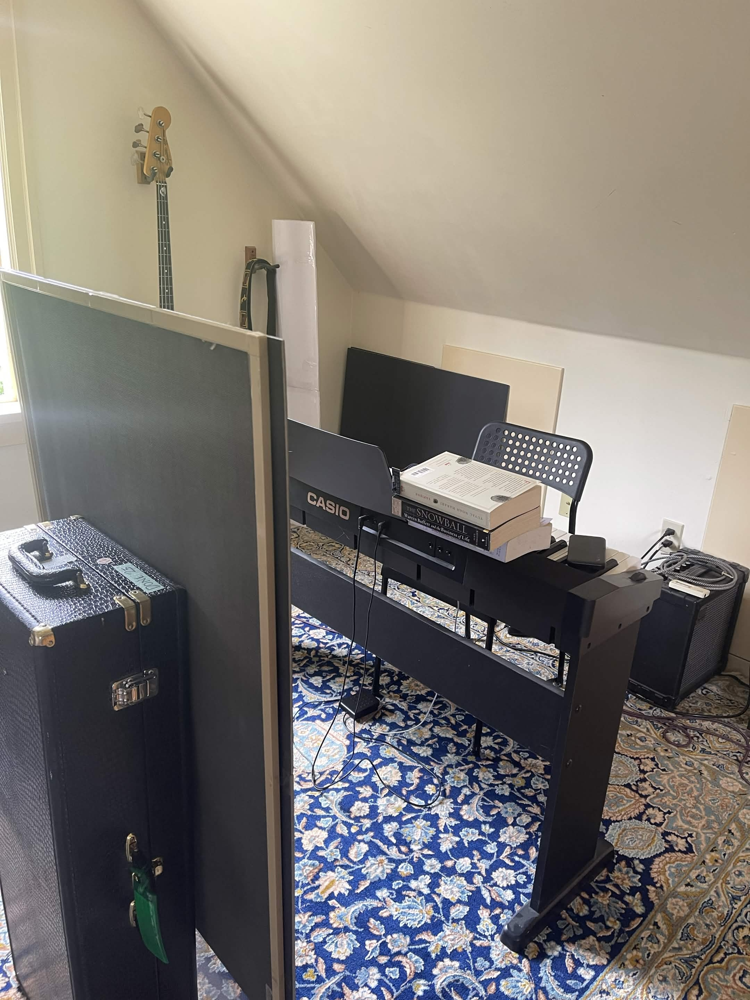
  &nbsp;
  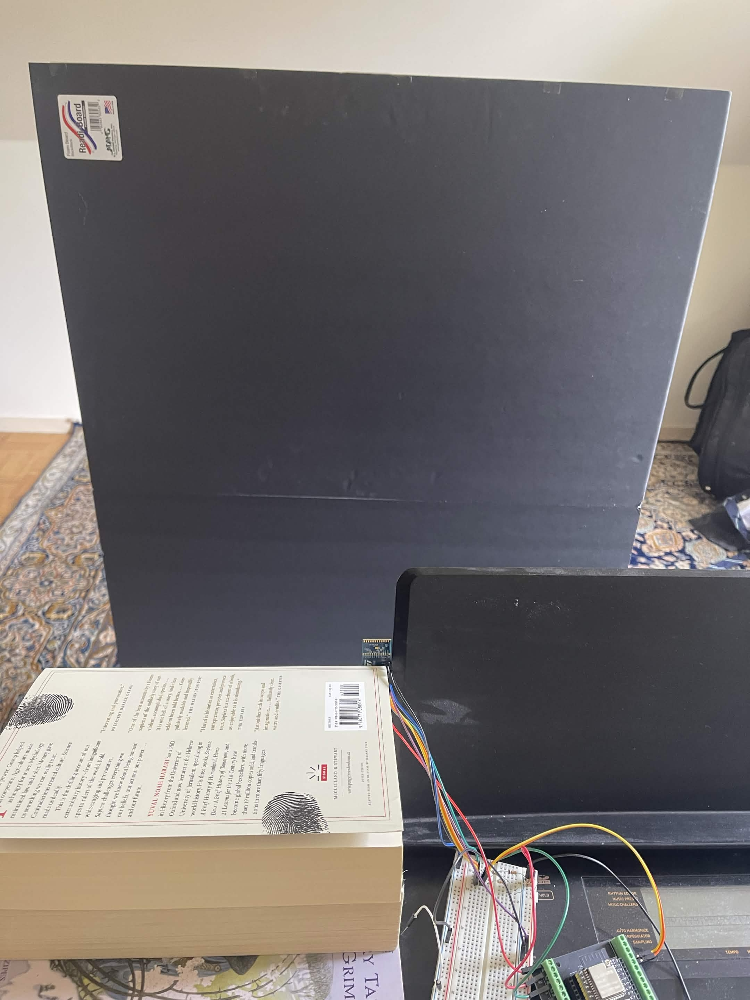
</p>
<p align="center"><em>Two black foam boards (~76 × 122 cm total) raised on a music stand, sensor mounted on a breadboard sitting on top of a digital keyboard at 34.5″ above the floor. Black foam is a worst-case low-IR-reflectance surface — anything that worked here is a baseline for everything brighter.</em></p>

### What I added for the sweep

- **Multi-client TCP fan-out** in the firmware. The previous firmware accepted exactly one TCP client at a time, so I couldn't run my visualizer and `measure.py` simultaneously — connecting one kicked the other off. I rewrote the broadcast layer to hold up to 4 client sockets and `send()` to each per frame with `MSG_DONTWAIT`. A slow client self-evicts when its `send()` returns negative instead of stalling the ranging task.
- **`STATUS:` line streamed per frame**, alongside the existing `DATA:` and `SIGMA:` lines. This gives me the raw ST UM3109 §5.5 status code (0 = no update, 5 = valid, 6 = wrap-around uncertain, 9 = low signal valid, etc.) for every zone every frame. Before this, I only knew whether a zone passed my filter — now I can see *which* failure mode it hit if it didn't.
- **Compile-time `#define` knobs** in `main.c` for `SHARPENER_PERCENT`, `TARGET_ORDER`, `STATUS_FILTER_STRICT`, plus the existing `SENSOR_RESOLUTION` and `RANGING_FREQ_HZ`. Each one wires into the corresponding ULD API call (`vl53l8cx_set_sharpener_percent()`, `vl53l8cx_set_target_order()`). One config = one line edit in `main.c` + one OTA flash.
- **PowerShell sweep runner** (`visualizer/run_sweep.ps1` + `run_one_test.ps1`) that loops over a hardcoded list of 17 configs, patches `main.c`, builds, OTAs, waits for the ESP to come back online, runs `measure.py` for 200 frames, and moves on. 17 configs × 3 distances = 51 captures, unattended.
- **3× retry-on-capture-failure** logic. The ESP's sensor I²C init fails about 20 % of the time after a warm reboot — my best guess is a power-rail dip from the WiFi startup current. When it fails, no `DATA:` lines come out and `measure.py` times out. My retry loop catches that, re-pushes the OTA to force another fresh boot, and tries again. Three attempts catches almost everything (0.2³ ≈ 1 % failure rate).
- **`measure.py` enhancements**: parses the new `STATUS:` line, writes per-zone-per-frame raw data to `raw_frames/`, computes detection-rate against the firmware buzzer threshold, prints the status-code distribution at the end of each run.
- **Analysis script** (`visualizer/analyze.py`) generates the plots in `visualizer/plots/` — σ-vs-distance scaling, config × distance heatmap, knob-impact breakdowns, per-zone σ heatmaps, per-zone mean-distance maps.

### Test methodology

- **17 configs:** A-series = 8×8 at 10/15 Hz × sharpener {0, 5, 20}. B-series = 4×4 at 10/15/30 Hz × sharpener {0, 5, 20}. C1 = STRONGEST target order (vs CLOSEST default). D1 = strict status filter {5 only} (vs default {5, 6, 9}).
- **Three distances:** 48 cm, 68 cm, 89 cm — perpendicular to the foam-board target.
- **200 frames per config**, all per-zone distance + sigma + status written to `raw_frames/` so I can re-analyze later without re-running anything.
- See [`photos/test_rig/test_rig_notes.md`](photos/test_rig/test_rig_notes.md) for the FoV math, the noted ~5–10° downward sensor tilt I eyeballed during setup, and the rest of the rig context.

### Results

#### Figure 1 — Distance noise scaling

<p align="center">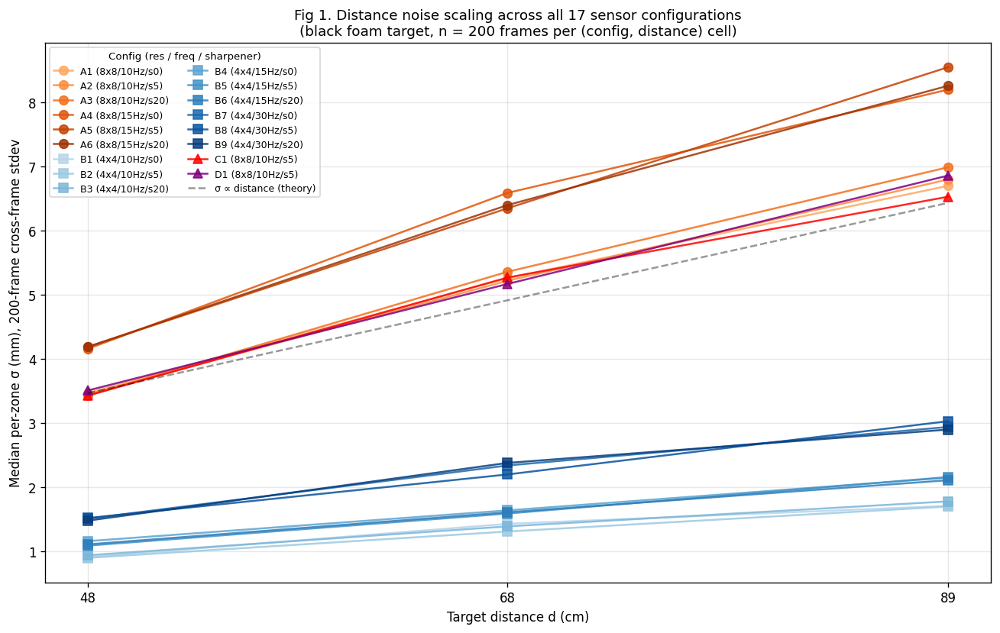</p>

**What this is:** Median per-zone σ (cross-frame standard deviation over 200 frames) vs target distance, one line per config. The dashed black line is the theoretical `σ ∝ d` prediction anchored at the A1 baseline.

**What I take from it:** All 17 of my configs track the linear prediction cleanly. That confirms the noise floor is **shot-noise-dominated** — N photons per measurement scales as 1/d² for a target filling the sensor's view, and Poisson statistics give σ ∝ 1/√N, so σ ∝ d. This is the physical floor; no firmware tuning of mine can beat it on the same hardware. The clean separation between the orange (8×8) and blue (4×4) families is the second-biggest signal in this plot — at every distance I tested, 4×4 sits at roughly a quarter of the 8×8 noise.

#### Figure 2 — Cross-config noise comparison

<p align="center">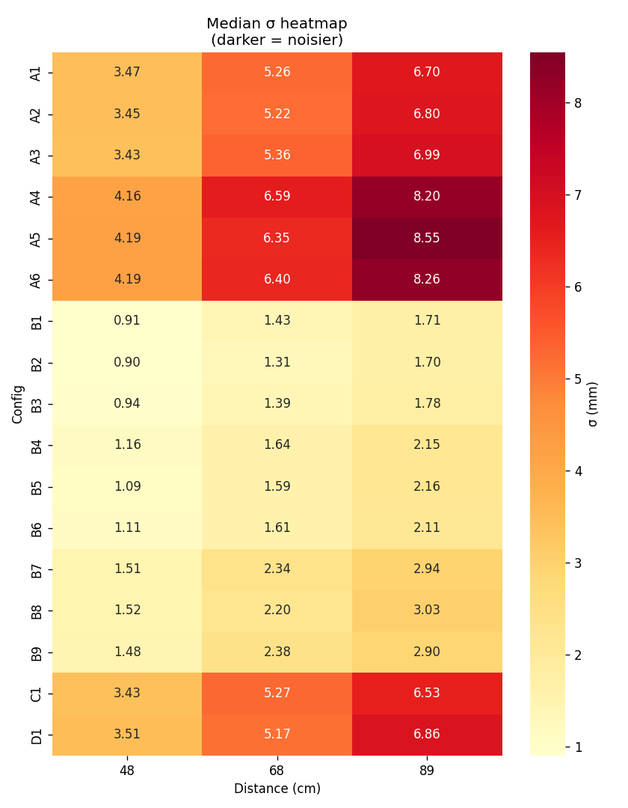</p>

**What this is:** Same dataset as Fig 1, reshaped as a heatmap so I can spot patterns by row. Dark = noisier (worse), light = tighter (better).

**What I take from it:** Two clean clusters jump out — the orange 8×8 block at the top (σ = 3–8 mm) and the pale 4×4 block in the middle (σ = 0.9–3 mm). Within each block, my rows are nearly identical across the three sharpener values (0/5/20), confirming the sharpener has no measurable effect on a uniform surface. My C1 (STRONGEST target order) and D1 (strict status filter) rows match A2 (CLOSEST / lax) within noise — those two knobs only matter when there's actual scene ambiguity (multiple targets per zone, partial-quality reads), which my flat foam board doesn't provide.

#### Figure 3 — Isolated knob-impact studies

<p align="center">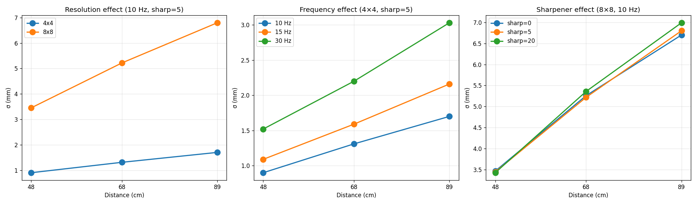</p>

**What this is:** Three one-factor-at-a-time studies. Each panel varies one knob with the others held fixed, so I can attribute the effect cleanly. Panel (a) = resolution; panel (b) = ranging frequency; panel (c) = edge-sharpener.

**What I take from it:**
- **(a) Resolution dominates every other knob.** 4×4 buys me ~4× tighter σ at every distance I tested. Each 4×4 zone aggregates 4× more SPADs than an 8×8 zone, AND the firmware can spend ~4× longer integrating per zone (same total budget, fewer zones). The combined effect is much larger than the naïve 2× shot-noise prediction from SPAD count alone.
- **(b) Frequency has a real noise cost.** My 10 → 15 → 30 Hz points track roughly √(freq) — exactly what I'd predict from less integration time per frame. Useful trade-off knob: I pay σ for faster reaction time.
- **(c) Sharpener is a no-op on this surface.** All three sharpener values overlap. The sharpener is a post-processing edge enhancement; on a uniform flat board with no edges to enhance there's nothing for it to do. I'd expect this to look different on doorways or furniture corners, but my static rig can't tell.

#### Figure 4 — Sensor self-calibration check

<p align="center">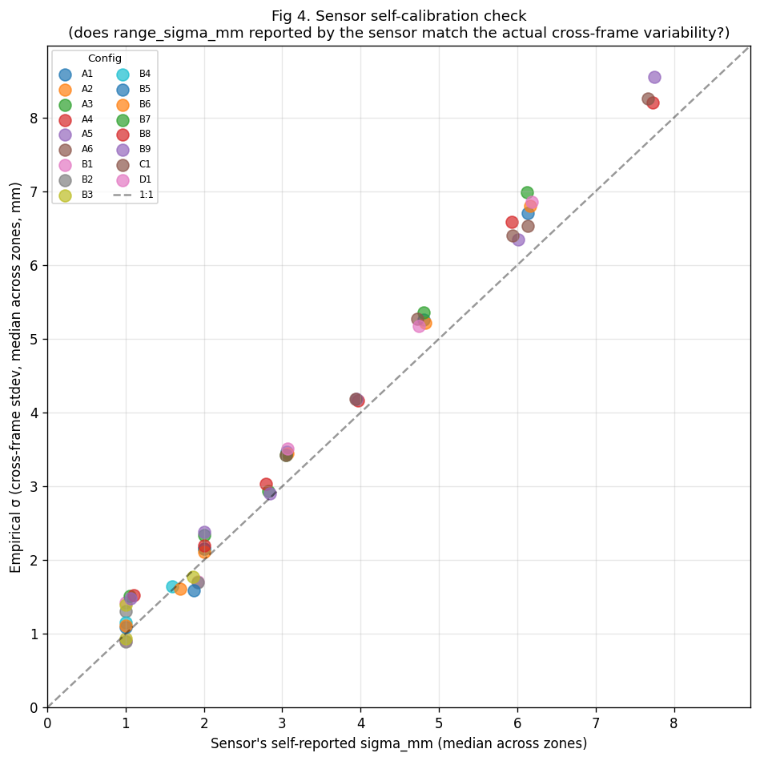</p>

**What this is:** The sensor reports its own per-reading confidence estimate (`range_sigma_mm`). This plot puts the sensor's self-reported sigma on the x-axis against my empirically-measured cross-frame stdev on the y-axis. The dashed line is 1:1 (perfect agreement).

**What I take from it:** My points hug the 1:1 line across every config. That tells me the sensor's confidence number is trustworthy and I can use it directly for downstream filtering (e.g. "ignore any zone whose reported sigma > 50 mm") without computing my own running stdev at runtime. Important for the helmet: on the ESP I won't have time to do batch statistics per frame, so being able to lean on `range_sigma_mm` from a single measurement is a big win.

#### Figure 5 — Per-zone spatial σ maps

<p align="center">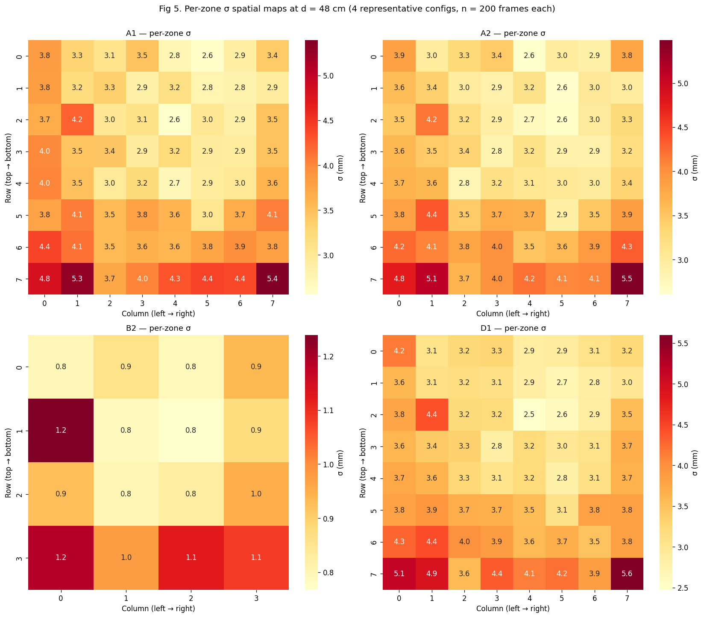</p>
<p align="center"><em>at d = 48 cm</em></p>

<p align="center">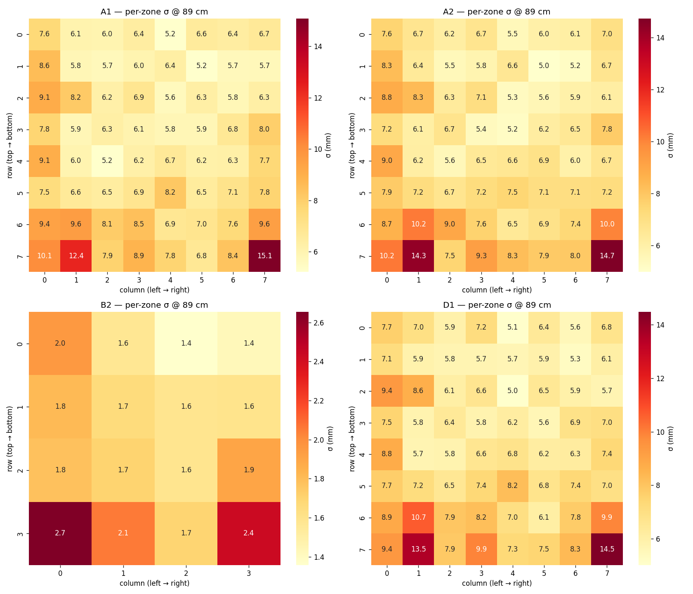</p>
<p align="center"><em>at d = 89 cm</em></p>

**What this is:** Each square is the cross-frame σ for one specific zone of the array (8×8 for A1/A2/D1, 4×4 for B2). I show the same configs at two distances so I can see how the spatial pattern changes with range.

**What I take from it:** Zones aren't equal. Even on a flat uniform target, my σ varies by ~50 % across the FoV — the corners are noisier than the center because the optical return is weaker at oblique angles (cosine fall-off of the surface). For the obstacle-avoidance use case this tells me I should **weight my center zones more heavily** than the edges when fusing, or just drop the corner zones from the alert logic entirely. The 4×4 panel (top-right) is tighter at every single cell, not just on average.

#### Figure 6 — Mount-tilt diagnostic

<p align="center">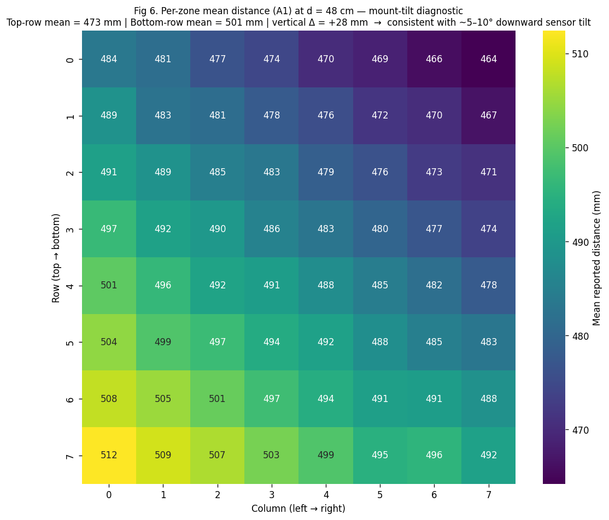</p>
<p align="center"><em>at d = 48 cm</em></p>

<p align="center">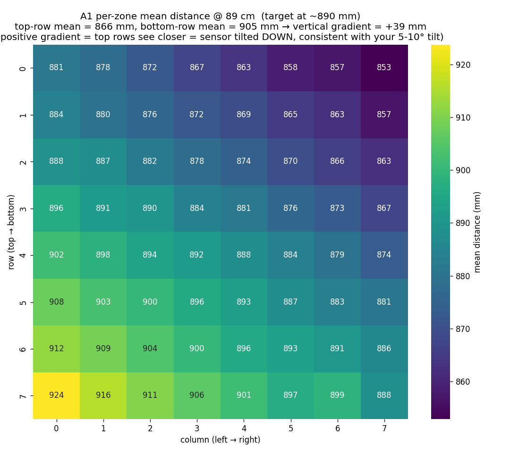</p>
<p align="center"><em>at d = 89 cm</em></p>

**What this is:** Per-zone **mean** distance over my 200 frames (vs Fig 5 which shows per-zone σ). At 48 cm the target is at ~480 mm; at 89 cm it's at ~890 mm. Color = mean reading per zone; annotations are the exact values.

**What I take from it:** The clean **top-to-bottom gradient** (~28 mm at 48 cm, ~50 mm at 89 cm) directly visualises my sensor's mount tilt. Top rows read closer than bottom rows because the sensor on my rig was angled slightly down — those upper-row zones look at the upper part of the board head-on, while the lower-row zones look at the lower part on a longer slant path. This confirms the ~5–10° downward tilt I had eyeballed at setup, and tells me that **before I can compute a meaningful "nearest object" distance I need a per-zone geometric correction** that accounts for the actual mount angle. For the helmet that compensation has to come either from a known fixed mount geometry (good enough for v1) or from a live IMU pitch reading once I add the IMU later.

### My tentative config picks (provisional — see Limitations below)

- **4×4 over 8×8** for the helmet, unless I find a use case that genuinely needs the spatial detail. 4× lower noise floor is too big to give up.
- **10 Hz** as the default frame rate — buys ~2× better σ vs 30 Hz, still fast enough to react at walking speed.
- **Skip the sharpener** until I'm working with edge-rich scenes (doorways, furniture corners). Currently a no-op on my test surfaces.
- **Keep target order on CLOSEST** — safer default for obstacle avoidance, zero cost on simple scenes. Out-of-the-box default is STRONGEST per ST UM3109 §4.9, so this is an explicit override I'm carrying.
- **Keep status filter on lax {5, 6, 9}** — I get 100 % status-5 at short range on most surfaces anyway, and the lax filter is more forgiving when surfaces get harder.
- **Apply per-zone geometric correction** before computing "nearest distance" if the sensor mount tilts more than a few degrees off the ground plane.

### Limitations of this analysis

The static foam-board sweep tells me the sensor's **physical noise floor**, but it doesn't tell me which configuration will actually be best on a moving helmet in real environments. The bottleneck in wearable use is rarely shot noise — it's:

- **Ambient sunlight** saturating the SPADs (my room had indirect daylight; outdoor noon is a different game)
- **Surfaces I didn't test:** glass, polished floors, dark fabric at oblique angles, mirrors
- **Motion noise** during head turns (none of my data is moving)
- **Geometric coverage gaps** — the things I've already noticed while wearing the helmet (missed pullup bar above sensor height, missed low obstacles near my body that read as far slant distances)
- **Edge-rich scenes** where the sharpener might actually matter (the sweep didn't include any)

So my "best-config" picks above are **provisional**. They're the right defaults to start dynamic wearable testing with, not a final decision. The next phase of this project is to wear the helmet, walk through real environments, and let those constraints reveal which knobs need re-tuning.

The full raw data behind every plot lives in [`visualizer/raw_frames/`](visualizer/raw_frames/) (51 CSVs, 200 frames × 64 or 16 zones × distance + sigma + status — nothing aggregated, nothing thrown away). To regenerate the plots from scratch: `python analyze.py` inside `visualizer/venv`.

### v9 architecture

```
              ┌────────────────────────────────────────────────┐
              │              run_sweep.ps1 (host)              │
              │  loop over 17 configs:                         │
              │   ├─ patch main.c #defines                     │
              │   ├─ idf.py build                              │
              │   ├─ curl -X POST /update  (OTA reflash)       │
              │   ├─ wait for ESP reboot + TCP-3333 alive      │
              │   └─ measure.py --frames 200 --config <label>  │
              └──────────┬─────────────────────────────────────┘
                         │  TCP 3333 (data stream)
                         ▼
┌────────────────────────────────────────────────┐
│              ESP32-S3 firmware                 │
│ ┌──────────────┐    ┌─────────────────────────┐│
│ │ ranging_task │ ─► │ tcp_write (broadcasts  )││ ── DATA:…
│ │  (sensor I²C │    │ to up to 4 clients     )││ ── SIGMA:…
│ │   @ N Hz)    │    │                        )││ ── STATUS:…
│ └──────────────┘    └─────────────────────────┘│
│ +  OTA HTTP server on port 80 (POST /update)   │
└────────────────────────────────────────────────┘
                         │  TCP 3333
              ┌──────────┼───────────────────────┐
              │          │                       │
              ▼          ▼                       ▼
       ┌──────────┐ ┌──────────────────┐ ┌────────────────────┐
       │ Live     │ │ measure.py       │ │ ... (up to 4)      │
       │ visual-  │ │ → CSV + raw     │ │                    │
       │ izer     │ │   per-frame logs│ │                    │
       └──────────┘ └──────────────────┘ └────────────────────┘
```

### Files added

- `visualizer/run_sweep.ps1` — outer loop, all 17 configs
- `visualizer/run_retry.ps1` — re-runs subset (failed configs)
- `visualizer/run_one_test.ps1` — patch + build + OTA + capture, with 3x retry
- `visualizer/analyze.py` — load CSVs, generate the 8 plots
- `visualizer/measurements.csv` — per-zone aggregates (one row per zone per run)
- `visualizer/measurements.summary.csv` — one row per run (the rank-able file)
- `visualizer/raw_frames/*.csv` — every frame's distance + sigma + status per zone
- `visualizer/plots/*.png` — analysis output
- `photos/test_rig/` — rig photos, FoV math, future-test ideas

### Lessons from v9 dev

- **OTA can leave one partition in a bad state.** ESP-IDF rotates between `ota_0` and `ota_1` on each OTA. After ~30+ cycles in a row I hit a state where one slot booted cleanly and the other hung. **My fix:** USB-flash via `idf.py -p COM10 flash` rewrites bootloader + both slots + `ota_data_initial` cleanly. Once I did that one manual recovery flash, the next dozens of OTAs worked fine.
- **`MSG_DONTWAIT` on `send()` is essential for fan-out broadcast.** Without it, a slow-reading client stalls the ranging task for every other client. Per-client failure now self-evicts the slot in my `tcp_write` loop.
- **PowerShell + UTF-8-no-BOM scripts = silent parse error.** Em-dashes (`—`) in `.ps1` files trip Windows PowerShell 5.1's parser with a misleading "missing closing brace" error pointing at the wrong line. Stuck to ASCII after I burned an hour chasing that.
- **`$ErrorActionPreference = "Stop"` makes Python tracebacks escape my retry loop.** I had to wrap the `measure.py` call in a `try`/`catch` AND momentarily set EAP to `Continue`, or one Python crash would kill the whole sweep instead of triggering the next retry attempt.
- **Sensor I²C init flakes ~20 % after a warm reboot.** Likely a power-rail dip from WiFi startup current. My firmware mitigation (start the ranging task first, give it a 2.5 s head start before WiFi comes up) helps but doesn't eliminate it. My host-side 3× retry catches the remainder.

### Refinements I added after the initial sweep (preparing for dynamic testing)

These came up immediately after the static sweep, while I was getting the sensor ready to actually wear:

- **Firmware-side mount-rotation compensation** (`MOUNT_ROTATION_DEG` in `main.c`). The sensor on my helmet sits rotated 90° from "natural" body orientation. Rather than fix it in every host script independently, I added a `rotated_zone()` helper in firmware and threaded it through all three stream functions (`DATA:` / `SIGMA:` / `STATUS:`). The chip now emits zones in body-frame regardless of how the breakout board is physically oriented on the helmet — single source of truth, every downstream consumer (visualizer, `measure.py`, future slant-compensation logic) sees correct orientation automatically. Supports 0 / 90 / 180 / 270 by changing one `#define`.
- **Visualizer frame-rate decoupling.** The old reader thread emitted a Qt signal for every frame it received from the TCP stream. If the GUI thread couldn't keep up, Qt's signal queue accumulated indefinitely — after a few thousand frames the visualizer lagged badly and eventually froze. I switched the reader to write the latest frame into a shared variable and the GUI to render via a 30 Hz `QTimer`. Older frames now get silently overwritten; no queue accumulation, no lag growth.
- **Visualizer auto-reconnect** with a backoff. The old version died on any socket timeout. The new one catches `socket.timeout` and `OSError` ("cannot read from timed out object", which the buffered file reader raises differently), closes the socket, and reconnects. This matters during the OTA cycle — every flash drops the connection, and now the visualizer comes back automatically when the ESP reboots.

---

## v10 — Wearable: helmet mount, body-frame alerts, phone-direct viewer

v9 proved what the sensor could do on a desk. v10 was about actually wearing the thing and getting it to behave like an obstacle-warning device for someone moving through real space. This iteration is much more about the *system* than the sensor — calibrating the mount, converting raw sensor readings into body-relative distances, deciding what's worth alerting on, and giving myself a way to debug the rig while walking around.

### What changed

**Firmware-side mount-rotation compensation.** The sensor PCB on my helmet sits rotated 90° from its "natural" orientation. Rather than fix that in every host script, I added a `MOUNT_ROTATION_DEG` constant (270°) and a `rotated_zone()` helper that remaps zone indices inside the firmware's stream functions. Every downstream consumer — visualizer, `measure.py`, slant-compensation logic, the new phone viewer — now sees zones in body frame automatically.

**Wall-stare tilt calibration.** I wrote `visualizer/calibrate_tilt.py`: wear the helmet, stand still facing a flat wall at a known distance, capture 200 frames, fit the sensor's actual mount pitch from the per-row mean distance pattern. The fit said **~13° pitch down** on the first iteration. After repositioning the mount I re-measured and the current value is **20° down**. The calibration also revealed a small roll component (the gradient across columns was non-zero, suggesting the sensor isn't perfectly aligned with body axes) — small enough to ignore for v1.

**Per-row slant→forward compensation.** With pitch known, each row of the rotated 8×8 grid has a known elevation angle. The firmware now precomputes a per-row cosine table at boot and converts each zone's slant distance to body-frame forward distance: `forward = slant × cos(zone_elevation + mount_pitch)`. The buzzer now alerts on **forward distance**, not slant. Fixes the failure mode I saw before: a chair 50 cm in front of my body but 50 cm tall reads a 130 cm slant distance — without this compensation the buzzer never triggers because the slant is past threshold.

**Per-row alert thresholds.** Single global threshold of 60 cm didn't work because the bottom rows' field of view exits the body-near region before an obstacle can reach 60 cm forward. By the time a chair-height obstacle is 60 cm forward of my body, it's already outside the sensor's downward cone — the firmware has no ray pointing at it. Fix: each row gets its own threshold, scaled for how soon obstacles leave its FoV.

| Row | Body region | Threshold (cm) |
|---|---|---|
| 0 | Overhead | 60 |
| 1 | Head | 60 |
| 2 | Upper head | 60 |
| 3 | Head / shoulder (optical axis area) | 60 |
| 4 | Shoulder | 70 |
| 5 | Upper chest | 80 |
| 6 | Chest | 85 |
| 7 | Belly button / waist | 90 |

Bottom rows fire while obstacles are still in view; top rows still use the tight 60 cm so overhead obstacles don't chirp the buzzer when I look around in a room with normal ceilings.

**Phone-direct web viewer.** Earlier I tried Spacedesk (mirror laptop screen to iPhone) for viewing the data while wearing the helmet. It didn't work across rooms and was laggy when it did. Switched approach entirely — the ESP itself now serves a tiny HTML viewer on `GET /`. The page polls `GET /api/status` every 200 ms for JSON containing nearest forward distance, the per-row thresholds, alert state, and the full 64-zone grid. Phone opens `http://192.168.1.228/` in Safari, sees live data, no laptop in the loop. Works anywhere on the same WiFi.

The big number is the nearest forward distance (in cm). Background colour flips green→yellow→red. Each cell in the 8×8 grid is coloured against its own row's threshold (so the bottom row goes red at a different distance than the top row). The viewer pulls the threshold table from the JSON, so when I change thresholds in firmware I don't have to edit the viewer.

**Bootloader rollback.** During wearable testing I bricked the ESP a few times — one of the OTA partitions would end up with a half-written image, the ESP would boot into it, and hang. Enabled `CONFIG_BOOTLOADER_APP_ROLLBACK_ENABLE` in `sdkconfig.defaults` and added a confirmation task that waits for WiFi + first sensor frame to succeed, then calls `esp_ota_mark_app_valid_cancel_rollback()`. If the new image fails to confirm (because the app crashed or WiFi never came up), the bootloader auto-reverts to the previous slot on the next boot. No more rescue USB-flashes for bad-boot bricks.

**OTA diagnostics.** Separately from the bricks-on-boot, I also kept seeing OTA writes drop mid-stream at the ~65 KB mark after many sequential OTAs. Couldn't reproduce reliably enough to fix the root cause yet, but I added enough instrumentation to diagnose next time it happens: verbose ESP-IDF logging (`CONFIG_LOG_DEFAULT_LEVEL_VERBOSE`), per-64-KB heap reporting inside the OTA handler, a new `GET /api/health` endpoint that returns free heap + min-free heap + uptime so I can monitor heap fragmentation over a session from the phone. My current hypothesis is heap fragmentation after long uptime, but I don't have data yet.

**Visualizer fixes.** The PyQt visualizer was accumulating Qt signal queue items when rendering couldn't keep up with the 15 Hz stream — after a few thousand frames it lagged badly and eventually froze. Decoupled the rates: reader thread writes to a shared "latest frame" variable, GUI renders at fixed 30 Hz via a `QTimer`, intermediate frames silently overwritten. Also added auto-reconnect with backoff so the visualizer survives ESP reboots during OTA cycles instead of dying.

### The hard physics finding

While testing, I confirmed something I'd suspected from the FoV math: **one head-mounted sensor cannot cover both above-head obstacles and belly-button-at-60-cm obstacles**. The numbers:

- Sensor at ~186 cm helmet height, pitched 20° down, 45° vertical FoV
- Cone reaches from 2.5° above horizontal to 42.5° below horizontal
- For an obstacle 60 cm forward of my body at belly button height (~120 cm): requires a ray at 47.7° below horizontal — outside the cone
- To cover from "slightly above head" down to "belly button at 60 cm" requires ~61° of vertical FoV; the sensor has 45°

Three ways out:
1. **Bump pitch to 25–30°** — catches belly button, loses everything above horizontal
2. **Mount sensor lower (chest level)** — catches belly button as near-horizontal, loses overhead
3. **Add a second sensor aimed down** — keeps the head-mount for overhead, dedicated second sensor for lower body. This is the real fix and it's on the todo list.

I'm running v10 with pitch 20° (keeps top-of-FoV overhead detection while extending lower coverage to chest), and accepting the belly-button-and-below blind spot at close range until I add the second sensor. The per-row thresholds make the most of what the sensor CAN see.

### v10 architecture

```
                ┌─────────────────────────────────────────┐
                │           ESP32-S3 firmware             │
                │                                         │
   ┌────────┐   │  ┌──────────────┐    ┌──────────────┐   │
   │ VL53L8 │──►│  │ ranging_task │    │ HTTP server  │   │
   │  CX    │I²C│  │              │    │  port 80     │   │
   └────────┘   │  │ -rotation    │    │              │   │
                │  │ -slant comp  │    │ GET /        │──►── HTML viewer
                │  │ -per-row     │    │ GET /api/    │──►── JSON status
                │  │  threshold   │    │  status      │      (nearest, alert,
                │  │              │    │ GET /api/    │       grid, thresholds)
                │  │ → g_alert    │    │  health      │──►── JSON diagnostics
                │  │ → g_nearest  │    │ POST /update │◄──── OTA reflash
                │  │ → g_grid     │    │              │
                │  └──────┬───────┘    └──────────────┘   │
                │         │                               │
                │         ▼                               │
                │  ┌──────────────┐    ┌──────────────┐   │
                │  │ buzzer_task  │    │ tcp_server   │   │
                │  │              │    │  port 3333   │──►── raw DATA/SIGMA/
                │  │ beep if      │    │ (4 clients,  │     STATUS lines
                │  │  any zone <  │    │  broadcast)  │     (for measure.py
                │  │  row thresh  │    │              │      and analysis)
                │  └──────────────┘    └──────────────┘   │
                └─────────────────────────────────────────┘
                          │                  │
                          ▼                  ▼
                     active buzzer      iPhone Safari or
                     on GPIO 6          laptop visualizer
```

### Lessons from v10 dev

- **The slant→forward conversion is meaningless if you ignore the FoV.** I spent time chasing why "body-level obstacles aren't detected" when the math was already doing what I asked. The math was correct — the obstacles just weren't in the sensor's cone. Always sanity-check whether the sensor can even *see* a thing before debugging why it doesn't *react* to it.
- **Mirror-via-screen-share doesn't scale to "walk around with a phone".** Spacedesk worked great when I was sitting next to my laptop, fell over when I walked into another room. The fix wasn't a better mirror tool; it was a different architecture (ESP serves the viewer directly).
- **Per-row thresholds are a clean way to encode "what each row is looking at".** Cleaner than a single global threshold + heuristics. Easier to tune empirically by walking around with the viewer and watching which cells fire.
- **Bootloader rollback is a one-config-line fix worth doing on any OTA-equipped device.** I should have enabled it on day one of v7. Cost: zero. Benefit: no more bricked partitions from interrupted/bad OTA writes.
- **Heap monitoring matters once you have multiple long-running tasks.** `/api/health` is two lines of code and gives me forever-running insight into whether memory is leaking or fragmenting.

### Files added/changed in v10

- `main/main.c` — rotation helper, slant-cos table, per-row thresholds, `g_alert_active` flag, OTA rollback confirm task, viewer HTML embedded, `/api/status` + `/api/health` JSON endpoints, OTA diagnostic logging
- `sdkconfig.defaults` — `CONFIG_BOOTLOADER_APP_ROLLBACK_ENABLE=y`, `CONFIG_LOG_DEFAULT_LEVEL_VERBOSE=y`
- `main/CMakeLists.txt` — added `esp_timer` requirement
- `visualizer/calibrate_tilt.py` — wall-stare tilt-angle fitter
- `visualizer/visualizer_simple.py` — frame-rate decoupling, auto-reconnect with backoff, adaptive 8×8/4×4 zone count
- `visualizer/raw_frames/wall-tilt-calib-h185cm-d81cm_*.csv` — calibration capture
- `photos/test_rig/test_rig_notes.md` — updated with helmet-mount height
- `todo.md` — living list of where this project is going

---

## v11 — Directional haptic feedback (3-motor ring)

v10's buzzer encoded *distance* via beep rate but not *direction* — a chirp told me something was close, but not whether it was to my left, ahead, or right. v11 adds three ERM coin motors driven from the ESP, mapped to the FoV's left / center / right columns, so the alert is now two-dimensional: the buzzer says "obstacle, close" and the motor against my skin says "on your left."

### What changed

**Three vibration motors on GPIOs 7 / 15 / 16.** Each motor is switched by a low-side 2N3904 NPN BJT (1 kΩ base resistor, motor sits between collector and 3V3, emitter to GND). All three share LEDC timer 1 at 1 kHz across channels 1–3 (the buzzer keeps timer 0 / channel 0 — independent), so PWM duty cycle controls intensity per-motor with no cross-talk. Physical mapping (verified 2026-05-28 by single-pin pulse test): **GPIO 7 = center / forehead**, **GPIO 15 = right temple**, **GPIO 16 = left temple**.

**`HAPTIC_TEST` build flag in `main.c`.** Setting `#define HAPTIC_TEST 1` makes `app_main` skip the sensor ranging task and run `haptic_test_task` instead — full-on for 1.5 s on motor A, then ramp; same for B then C; then all three together. WiFi + the OTA HTTP server still come up, so I can OTA back to normal firmware without touching USB. This is the workflow that proved out all three motors over the air in a single afternoon (2026-05-28).

**Boot-time safety GPIO config.** Before anything else in `app_main` — even before NVS or WiFi — the three motor GPIOs are explicitly forced to OUTPUT-LOW with a pulldown enabled. Runs regardless of `HAPTIC_TEST`. This belt-and-suspenders step exists because of a real failure I hit during bring-up: a motor wired directly between 3V3 and ground (bypassing the transistor) was running continuously, generating broadband brush-arc noise that coupled onto the shared 3V3 rail AND radiated into the nearby I²C pull-up wires, corrupting the VL53L8CX's ~80 KB ULD firmware upload at sensor init. Fixing the wiring restored the sensor; the safety config ensures even a stuck-on transistor or a flaky reboot can't leave a motor running silently and overheating.

### Bring-up sequence I followed

Documented in [`docs/haptics-bringup.md`](docs/haptics-bringup.md), but the short version:

1. **Motor sanity** — motor leads briefly to 3V3 + GND. Confirms motor is alive and is NOT a piezo (piezo reads open-circuit; this read 70 Ω → real coil → needs flyback diode for clean switching).
2. **Driver build** — 2N3904 + 1 kΩ base resistor. Verified with multimeter diode mode (B→E and B→C both ~0.7 V) to confirm the pinout (E-B-C left-to-right, flat face toward me).
3. **One motor on GPIO 7** with `HAPTIC_TEST = 1`. OTA-flashed. Felt smooth ramp 0→100 %. (2026-05-26.)
4. **Scaled to three motors** on GPIO 7 / 15 / 16. Per-motor phase verified each one fires on cue; all-three-together at full duty draws ~130 mA on the shared 3V3 rail without browning out the regulator or any visible sensor disturbance. (2026-05-28.)
5. **Caps + diodes intentionally skipped for bench**. The 1N5819 Schottky kit is in the mail; 33 µF + 22 µF caps are on hand but not soldered. Recommended for the final worn-perfboard build, not required for the dev board.

### Why directional haptics matter for this helmet

For a visually-impaired user, "something is close" without "where" forces them to stop and sweep their head to localise — exactly the failure mode Ghaffari et al. 2025 hit with single-buzzer alerts. With three motors at left temple / forehead / right temple the alert encodes left / centre / right directly into skin, which (per their wrist-haptic study) the brain localises laterally with near-100 % accuracy in well-separated mounts. The centre (forehead) motor stays useful as a "straight ahead" cue even when the user is turning, because head-relative direction is what they actually need to steer around.

Comfort caveat: the same Ghaffari paper switched from head to wrist haptics because pilot users found head-mounted ERMs uncomfortable for sustained wear. Worth pressure-testing the helmet ring on long sessions before committing to the design.

### Directional drive (column → motor) — live in sensor mode

`ranging_task` drives all three motors every frame from the live depth grid:

- **Column → motor:** body-frame col 0 → LEFT (GPIO 16), cols 1–2 → CENTER (GPIO 7), col 3 → RIGHT (GPIO 15). Generalizes to 8×8 (outer quarter of columns → side motors).
- **Per-motor urgency:** each motor tracks the *most-urgent* obstacle (lowest forward/threshold ratio) in its column region, same integer cross-product math as the buzzer.
- **Squared duty curve with a floor:** `duty = MIN + (MAX − MIN) × (1 − ratio)²`. The squared shape concentrates intensity near point-blank (Stevens-law-supported for alerting); the `HAPTIC_DUTY_MIN` floor (130) jumps an alerting motor straight to "just-felt" the instant the buzzer fires — without it, the ERM dead zone left the motor silent until ~20 cm.
- **Dominance weighting:** when ≥2 motors fire, the strongest keeps full duty and the others have only their *above-floor* portion scaled to 70 %, so they stay felt but clearly secondary (mitigates the multi-motor comprehension drop documented in Zegarra Flores 2022).

Full design + primary sources: [`docs/research-sources/directional-haptics-mapping.md`](docs/research-sources/directional-haptics-mapping.md).

### Configuration knobs

| Define | Default | Notes |
|---|---|---|
| `HAPTIC_TEST` | `0` | `1` runs the standalone 3-motor test ramp instead of the sensor pipeline. WiFi + OTA stay up either way. |
| `HAPTIC_ID_MODE` | `0` | When `HAPTIC_TEST=1`, `1` pulses only `HAPTIC_ID_GPIO` for physical-motor identification. |
| `HAPTIC_DIRECTIONAL` | `1` | Directional column→motor drive in sensor mode. `0` = buzzer-only (motors stay off) without rewiring. |
| `HAPTIC_DUTY_MIN` | `130` | ERM dead-zone floor (≈51 % of 255). An alerting motor jumps to this duty immediately; the curve ramps it to `MAX` at point-blank. Raise if weak at threshold. |
| `HAPTIC_DOMINANCE_NUM` / `_DEN` | `7` / `10` | Above-floor scale applied to non-dominant motors when ≥2 fire. |
| `HAPTIC_GPIO_CENTER` / `_RIGHT` / `_LEFT` | `7` / `15` / `16` | Verified physical mapping. Move to other free GPIOs only — avoid strapping pins 0, 3, 45, 46 on ESP32-S3. |

### Wiring (one per motor)

```
                    +3V3
                     │
                     ├──────────────┐
                   [motor]    [1N5819 Schottky]   ← optional for bench,
                     │       (cathode → +3V3)        recommended for final
                     ├──────────────┘
                     │
               Collector (pin 3, right)
                     │
   GPIO ──[1 kΩ]── Base (pin 2, middle)
                     │
               Emitter (pin 1, left)
                     │
                    GND  (shared with ESP32 GND)
```

### Lessons from v11 dev

- **Brushed DC motor noise can wreck I²C sensor init.** Brush arcing emits broadband RF that couples both conductively (shared 3V3 rail) and inductively (nearby pull-up wires). A continuously-running motor next to the sensor's I²C bus corrupted enough bits in the 80 KB ULD firmware upload that the sensor reported `is_alive = false` 100 % of the time. The motor doesn't even need to be PWM'd — DC-on is enough. Fix at the system level: cap the motor for noise (100 nF ceramic across motor terminals), bulk cap the rail (100 µF), make sure the transistor is actually in the path so the motor isn't running unless commanded.
- **A safety GPIO config at boot is cheap insurance.** Even with the test flag off, force the motor pins to a known-LOW state at the start of `app_main` before anything can configure them otherwise. Costs four lines of code per pin and prevents the worst-case "GPIO floats high on warm reboot → transistor partly conducts → motor runs forever" failure mode.
- **The `frames` field in `/api/health` is currently `g_latest_grid_side`, not an actual frame counter.** Misled me once during bring-up — saw `frames: 4` and thought the sensor had only produced 4 frames; really it meant "4×4 grid is active and streaming." Open TODO to make it a real counter; in the meantime the comment in `main.c:742` calls it out.
- **OTA-flashable test mode beats USB-flash test mode.** The `HAPTIC_TEST` flag pattern lets me iterate on motor behaviour without ever pulling the helmet off the desk for a cable swap, and without losing the sensor firmware. Same flag-and-flag-back workflow would suit any future actuator bring-up (speaker, LED ring, second buzzer).
- **A proportional curve needs a floor on a real motor.** The squared urgency curve looked right on paper but felt broken in the hand: the buzzer alerted at the threshold distance while the motor stayed dead until ~20 cm, then slammed to full. ERM coin motors simply don't spin below ~50 % duty, so the bottom half of any 0→max curve is wasted. The fix is to map the alert band onto `[MIN..MAX]`, not `[0..MAX]` — the motor is felt the moment the alert fires and the curve shapes intensity above that. This is the same "just-noticeable floor" Ghaffari 2025 uses.
- **Driving motors during normal operation reintroduces the noise risk.** Bench-testing motors in a dedicated mode was clean, but once `ranging_task` drives them continuously during alerts, a sustained point-blank obstacle pins motors at high duty and the brush noise can wedge the HTTP server on the un-decoupled bench rig. The motor caps + rail bulk cap (deferred as "optional for bench") become genuinely necessary for the worn build.

### Files added/changed in v11

- `main/main.c` — `HAPTIC_TEST` / `HAPTIC_ID_MODE` flags, verified `HAPTIC_GPIO_CENTER/RIGHT/LEFT` mapping, `haptic_test_task`, safety GPIO config at top of `app_main`; **directional drive**: LEDC infra hoisted out of `#if HAPTIC_TEST`, `haptic_motors_init()`, `haptic_motor_for_col()`, `haptic_apply()` (squared curve + `HAPTIC_DUTY_MIN` floor + dominance weighting), per-motor urgency tracking in `ranging_task`
- `docs/haptics-bringup.md` — full bring-up log: parts list, transistor pinout, driver schematic, test sequence, OTA workflow, results log, directional-drive implementation + dead-zone fix
- `docs/research-sources/directional-haptics-mapping.md` — cited research behind the mapping/curve/dominance decisions

---

## What's next (queued)

After v11 the helmet is wearable with two-dimensional alerts (distance + direction) — the buzzer encodes urgency, the three motors encode direction, and both fire together. Next steps are walk-testing, filling in the bottom 1/3 of body coverage, and graduating from a prototype to something I'd trust.

1. **Walk-test + tune the directional haptics.** The column→motor drive is implemented and bench-confirmed. Remaining is real-world tuning: dial in `HAPTIC_DUTY_MIN` for the actual motors, confirm direction holds while moving, and watch the one open stability item — the HTTP server wedged once when motors ran sustained at point-blank on the un-decoupled bench rig. Mitigations on deck: motor-terminal 100 nF + rail 100 µF caps (mailed), optional duty cap, optional HTTP watchdog.
2. **Solder the perfboard rim** when the 1N5819 Schottky diodes arrive — three transistors, three 1 kΩ resistors, three flyback diodes, one 100 µF bulk cap across the 3V3 rail, JST connectors out to the motors so the helmet can be removed without de-soldering.
3. **Second VL53L8CX aimed downward** — fixes the belly-button-and-below blind spot. SPI bus (cleaner than I²C for two sensors — no address conflict). Independent calibration, independent per-row thresholds, fused into a single body-frame alert.
4. **Multi-target per zone** (`VL53L8CX_NB_TARGET_PER_ZONE = 2`) — helps thin obstacles in open doorways (pullup bar with open space behind). Per ST UM3109 §4.10, this only resolves targets separated by ≥ 600 mm — so it won't help bars with a wall right behind them, but doorways usually have several metres of room beyond.
5. **Bird's-eye-view mode for the phone viewer** — top-down body-centered radar display instead of the sensor-grid layout. Becomes more useful once the second sensor is in (one fused view of all obstacles around me, not two separate per-sensor grids).
6. **IMU on the helmet** — gravity-anchored pitch/roll so the slant→forward correction adapts when I look up/down instead of assuming level head. Cheaper interim path: iPhone IMU streamed over WiFi UDP (Phyphox app).
7. **Phase 2 — USB camera + CV** — classify what the ToF is detecting (person vs wall vs glass) so the alert pattern can encode object type, not just distance.

Living list of all open work, hardware notes, and recurring pitfalls is in [`todo.md`](todo.md).

Full research synthesis behind the current parameter picks — including a re-analysis of my v9 data through a wearable-latency lens, plus ST documentation deep-dive, academic literature review, and commercial-device market survey — is in [`docs/research-optimal-config.md`](docs/research-optimal-config.md). Headline finding: **no peer-reviewed work exists on a head-mounted VL53L8CX ETA for the visually impaired**, so several of the open questions on the helmet are genuinely unstudied and the project will generate new data along the way.

---

## A note on process

This project was as much a deliberate experiment in working with AI tools as it was a hardware project. Every design decision — the choice of EMA α, the Kabsch derivation, the six-second cap on the world-frame memory, the validity gates on the pose estimator — was something I worked through with Claude as a thinking partner. The aim wasn't to have an AI build this for me; it was to see how far I could push a real, end-to-end embedded project by integrating an AI into the loop the way an engineer integrates any other tool — and to be exposed to a stack of topics I'd otherwise only have read about in passing.

What this gave me exposure to, more than mastery of:

- The vocabulary and shape of an embedded firmware project — ESP-IDF, I²C bus configuration, ULD firmware uploads, component-registry dependencies, sdkconfig knobs.
- Why GPU-accelerated rendering and a threaded serial reader matter for an interactive app, even when the underlying maths could in principle run on the GUI thread.
- The general form of rigid-registration / Procrustes-style problems — what they're solving and where the small-motion correspondence assumption breaks — without pretending I could derive the SVD step from memory.
- The distinction between sensor-physics limits (yaw unobservability from a flat-floor depth map) and algorithm choices, and why an IMU is the standard fix for the former.
- The discipline of writing a limitations section that names root causes rather than handwaves.

The deeper maths and systems detail I'd still need to study to claim real fluency in. What I do have is enough familiarity with each topic to read the right next paper or datasheet section, recognise when something doesn't add up, and direct the next iteration of this project once the IMU arrives.

The full [`PROGRESS.md`](PROGRESS.md) captures the process as it actually happened — every wiring mistake, every wrong field name in a struct, every I²C timeout default that bit me. AI accelerated the path through dead ends; the choices, the trade-offs, and the willingness to throw out two complete visualiser rewrites are mine.

---

## References

- [ST VL53L8CX product page](https://www.st.com/en/imaging-and-photonics-solutions/vl53l8cx.html) — datasheet, 65° diagonal / 45°-per-axis FoV, 1–15 Hz at 8×8.
- [RJRP44/VL53L8CX-Library](https://github.com/RJRP44/VL53L8CX-Library) — the ESP-IDF wrapper this project uses ([component registry](https://components.espressif.com/components/rjrp44/vl53l8cx)).
- [ESP-IDF programming guide](https://docs.espressif.com/projects/esp-idf/en/latest/) — required v5.0+.
